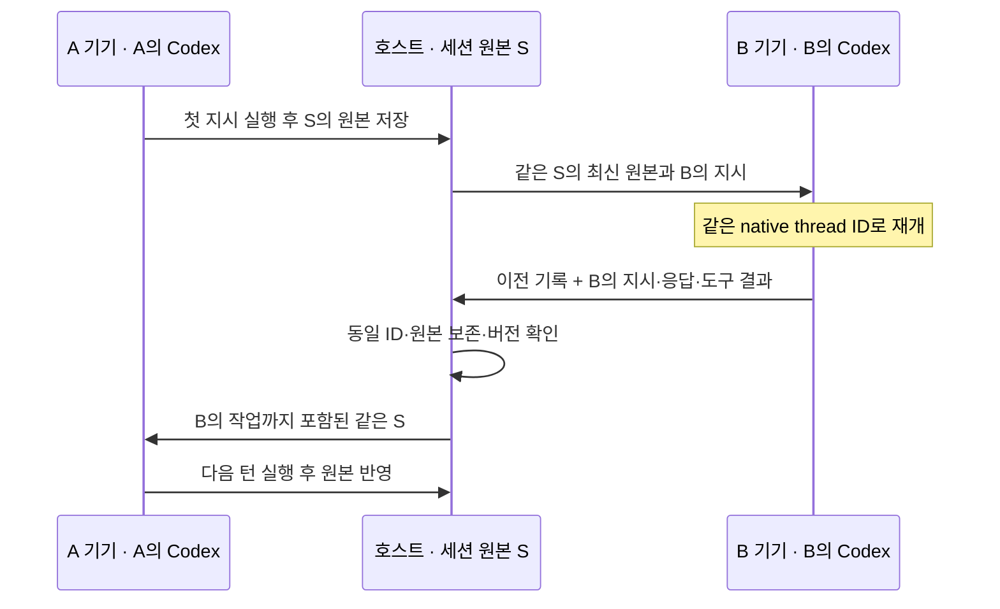

# hand-in-hand

**하나의 workspace, 하나의 AI 세션. 다음 차례는 내 AI로.**

hand-in-hand는 호스트 PC의 프로젝트와 Codex 세션을 여러 사람이 함께 이어서 사용하는 협업 프로토타입입니다. 동료가 내린 지시와 AI의 작업 결과를 같은 대화에서 확인하고, 자신의 기기에 연결한 Codex로 다음 작업을 요청합니다.

파일과 세션 원본은 호스트가 보관합니다. 참여자는 프로젝트 전체를 복제하지 않고 기본 셸·파일 도구로 호스트에서 읽고 수정합니다. 기본 원격 연결은 **Tailscale Serve의 사설 HTTPS**입니다.

> 현재는 **Codex 전용 프로토타입**입니다. 같은 계정의 독립 실행기 두 개로 A → B → A를 검증했고, 사용자 테스트에서는 서로 다른 계정으로 보고된 실행기 사이의 대화 재개도 확인했습니다. **계정별 실제 할당량 차감과 전체 기기별 설치 과정은 별도 검증이 필요합니다.**

## 주요 기능

- **동일 세션 재개:** Codex의 같은 native thread ID와 원본 JSONL 기록을 이어받습니다.
- **이전 기록 보존 검사:** 호스트가 SHA-256, 버전, 기존 기록의 변경·누락 여부를 확인합니다.
- **참여자별 실행기:** 제출자의 기기에 연결한 Codex로 해당 지시를 실행합니다.
- **기본 Codex 도구:** 셸, 파일 편집, 테스트·빌드, 웹 검색을 활성화합니다. 프로젝트 명령은 호스트에서 실행합니다.
- **개인 도구 연결:** 참여자 기기의 MCP·플러그인·스킬 설정을 불러옵니다.
- **승인·질문:** 명령과 파일 작업 승인은 호스트가, Codex 질문과 개인 연결 도구 확인은 지시 작성자가 공유 화면에서 응답합니다. 실행 도중 요청이 도착하면 응답 창을 즉시 열어 완료를 기다리지 않고 허용하거나 거절할 수 있습니다.
- **실시간 확인:** AI 응답, 도구 결과, 진행 상태와 HTML·개발 서버 미리보기를 표시합니다. 개발 서버의 HTTP와 WebSocket을 전달합니다.
- **개발 서버 관리:** 화면에서 프로젝트의 npm 스크립트를 확인하고 실행·중지하며 로그를 함께 봅니다.
- **변경 비교와 복구:** 턴 전후의 파일을 보관하고 호스트가 파일별로 비교·복구합니다. 이후 변경과 충돌하면 복구를 거절합니다.
- **파일 전송:** 최대 50 MiB 파일의 업로드 재개·SHA-256 검사와 산출물 다운로드를 지원합니다.
- **관찰자:** 연결기 없이 기록·파일·미리보기를 볼 수 있는 읽기 전용 초대를 지원합니다.
- **기록 보관과 재개:** 세션 원본을 내보내고, 같은 작업공간의 보관된 native 세션을 다시 이어갑니다. 파일 작업·대기 지시 수정·취소 내역도 다음 턴에 전달합니다.
- **작업공간 선택:** 호스트 화면에서 프로젝트 폴더를 확인하고 전환합니다. 선택한 폴더는 재시작 후에도 유지합니다.
- **완료 기록 재전송:** 저장 응답이 유실되면 실행기가 보관한 완료 원본을 재검증합니다. 이미 저장된 턴은 다시 실행하지 않습니다.
- **재접속과 지시 접수 확인:** 일시적인 연결 장애에는 자동으로 재접속하고, 접수 응답을 받지 못한 지시는 같은 요청 ID로 확인·재전송합니다.
- **초안과 브라우저 연결:** 작성자·세션별 초안을 현재 탭에 저장하며, 선택하면 이 기기에서 참여 연결을 기억합니다.
- **대화 검색:** 지시·공개 AI 응답·도구 결과를 작성자와 상태로 필터링하고 해당 턴으로 이동합니다.
- **Tailscale 연결:** 앱에서 사설 HTTPS 연결을 켜고 끄며 초대 링크에 사설 주소를 적용합니다.
- **참여 관리:** 일회용 초대·실행기 연결 코드, 참여 권한 회수, 작업 중단과 기록 보관을 지원합니다.

여러 사람이 지시를 제출할 수 있지만 **AI 실행은 한 번에 한 턴씩, 제출 순서대로** 진행합니다. 각 실행기는 자기 차례 직전에 최신 세션 원본을 적용합니다.

작성자는 실행 전 **대기 지시 수정**으로 내용을 바꾸거나 취소할 수 있습니다. 수정 전 내용과 취소 내역은 공유 기록에 남으며, 다음 AI 턴에는 실행할 지시와 구분해 전달합니다. 이미 실행을 시작한 지시는 수정할 수 없습니다.

## 준비 사항

| 항목 | 필요 조건 |
| --- | --- |
| Node.js | 22 이상. 검증 환경은 24.11.1 |
| Codex | 공식 Codex CLI 설치와 본인 계정 로그인. 검증 버전은 0.153.4·0.154.0. 참여자는 0.154.0 권장 |
| Tailscale | 원격 협업에 참여하는 두 기기 모두 설치·로그인 |
| 호스트 PC | 프로젝트와 hand-in-hand를 실행한 상태로 유지 |

처음 설치하거나 업데이트한 뒤 `npm ci`를 실행합니다. WebSocket 전송용 `ws` 의존성이 추가됐습니다. Windows·Mac 사이의 세션 교대와 Mac 연결기에서 Windows 호스트 파일을 읽고 웹 검색하는 실행을 확인했습니다. Codex의 실험적 App Server 인터페이스를 사용하므로 CLI 버전이 달라지면 재검증이 필요합니다.

**ChatGPT 계정 로그인만 지원하며 API 키 인증은 차단합니다.** 현재 연결기는 공식 Codex의 로컬 `auth.json`에서 로그인 상태를 읽습니다. OS 자격 증명 저장소만 사용하는 환경에서는 `codex -c cli_auth_credentials_store="file" login`으로 파일 저장 방식에 로그인하세요. 접근 토큰은 같은 기기의 실행기에 메모리로만 전달하며 호스트에 전송하지 않습니다.

각 연결기는 자체 `codex-runtime/` 폴더에 세션·DB·쓰기 잠금을 저장합니다. Codex 데스크톱 앱의 기본 저장소와 충돌하지 않으며, 공유하는 native 세션 ID와 대화 원문은 유지합니다. ChatGPT 로그인 정보와 모델·공유 DB 설정은 복제하지 않습니다. MCP·플러그인·스킬 등 도구 설정과 설치 자산은 참여자 기기에서 불러옵니다.

## 빠른 시작: 호스트

Tailscale 앱에 로그인하고 연결한 뒤 터미널에서 실행합니다.

```powershell
git clone https://github.com/sonic240612/hand-in-hand.git
cd hand-in-hand
npm ci
codex login
npm start -- --tailscale
```

1. 호스트 PC에서 [http://127.0.0.1:4317](http://127.0.0.1:4317)을 엽니다.
2. 상단에서 **Tailscale 연결됨**을 확인합니다. 처음 HTTPS를 사용하는 네트워크라면 앱에 표시된 Tailscale 관리 링크에서 허용한 뒤 다시 연결합니다.
3. **내 Codex 연결 → 이 PC의 Codex 연결**을 누릅니다.
4. 동료의 Tailscale 기기 접근을 준비하고 **초대하기**로 세션 링크를 만듭니다.
5. 지시를 입력하면 실제 Codex가 공유 프로젝트에서 작업합니다.

처음 사용하는 기본 공유 폴더는 `workspace/`입니다. 포함된 `index.html`은 AI가 수정할 수 있는 샘플입니다. 첫 실행에 다른 프로젝트를 사용하려면 폴더를 지정합니다.

```powershell
npm start -- --tailscale --workspace C:\Workspace\my-project
```

이후에는 호스트 PC의 로컬 화면에서 **작업공간 설정 → 폴더 확인**으로 절대 경로와 파일 목록을 확인한 뒤 전환할 수 있습니다. 실행 중인 턴과 개발 서버를 끝내고 대기 지시를 취소해야 합니다. 전환하면 현재 세션을 보관하고 새 세션을 만들며, 다른 참여자와 기존 초대의 접근 권한을 회수합니다. 함께 사용할 사람은 다시 초대하세요. 파일을 옮기거나 삭제하지 않습니다.

선택한 폴더는 호스트 데이터에 저장됩니다. 다음 실행에는 같은 `--data`를 사용하고 `--workspace`를 생략하면 저장된 폴더로 시작합니다. 기존 세션을 다른 폴더에 연결하려는 `--workspace` 변경은 거절하므로 화면에서 전환하거나 별도의 `--data`를 사용하세요. 작업공간 선택은 로컬 소유자만 사용할 수 있습니다.

`npm start`만 실행하면 Tailscale 상태를 확인하고, 화면의 **Tailscale 설정 → Tailscale 연결 켜기**에서 사설 연결을 시작할 수 있습니다.

## 동료 초대와 참여

**Tailscale 기기 접근 권한과 hand-in-hand 세션 초대는 각각 필요합니다.** 세션 링크만으로 Tailscale 접근 권한이 생기지는 않습니다.

1. 동료도 자신의 PC에서 Tailscale에 로그인합니다.
2. 서로 다른 Tailscale 네트워크라면 호스트가 [Tailscale 기기 관리](https://login.tailscale.com/admin/machines)에서 이 PC를 공유하고, 동료가 기기 공유 초대를 수락합니다. 같은 네트워크라면 해당 기기의 HTTPS 포트에 접근할 수 있어야 합니다.
3. 동료에게 hand-in-hand의 **초대하기**에서 생성한 세션 링크를 전달합니다.
4. 동료가 링크를 열어 이름을 입력하고 **내 Codex 연결**에서 연결 코드를 확인합니다.
5. 동료의 PC에서 공식 `codex login`을 완료하고 연결 프로그램을 실행합니다. 아래 주소는 화면에 표시된 실제 주소로 바꿉니다.

```powershell
npm run agent -- --host https://호스트.네트워크.ts.net:8443
```

프로그램이 물으면 연결 코드를 입력합니다. 이후 브라우저의 같은 세션에서 지시합니다. 실행기를 다시 시작할 때는 `--resume`을 덧붙입니다.

`--resume`으로 시작할 때 호스트가 꺼져 있거나 네트워크가 끊겨 있으면 1초부터 최대 10초 간격으로 재접속하며 기다립니다. 호스트가 다시 열리면 저장 기록을 확인하고 자기 차례를 기다립니다. 대기 중에는 `Ctrl+C`로 종료할 수 있습니다. 기존 `.hih-agent` 폴더를 유지하고, `--data`를 사용했다면 같은 경로를 지정하세요. 권한 오류나 원본 검증 실패는 자동 재시도하지 않습니다. 처음 사용하는 일회용 연결 코드의 접수 실패에도 이 재시도 방식을 적용하지 않습니다.

초대 링크는 **24시간·1회**, 실행기 연결 코드는 **10분·1회** 사용합니다. 링크를 받은 사람에게 참여 권한을 주는 방식이므로 초대할 사람에게만 전달하세요. 이미 전달된 기록은 권한 회수 후에도 회수할 수 없습니다.

호스트가 실행 중인 참여자의 권한을 회수하면 브라우저 접근과 새 작업을 차단하고 현재 턴에 중단을 요청합니다. 해당 턴의 종료·저장 확인에 필요한 통신만 마무리한 뒤 실행기 권한도 회수합니다. 그 참여자의 대기 지시는 취소합니다. 종료 기록을 확인하지 못하면 세션을 차단한 상태로 유지합니다.

프로젝트 전체 대신 참여자 연결 프로그램만 전달할 수도 있습니다.

```powershell
npm run package:agent
```

생성되는 `dist/hand-in-hand-agent.zip`에는 실행기 코드·의존성 명세·사용 안내가 포함됩니다. 압축을 푼 폴더에서 `npm ci`를 실행합니다. 프로젝트 파일·로그인 정보·세션 원본은 포함하지 않습니다. 위의 동료 참여 절차와 [Tailscale 설정·문제 해결](docs/TAILSCALE.md)을 참고하세요.

호스트의 **초대하기 → 초대 권한**에서 관찰자를 선택하면 브라우저만으로 참여합니다. 관찰자는 AI 지시·실행기 연결·파일 업로드·설정 변경을 할 수 없습니다. 원격 관찰에도 Tailscale 연결은 필요합니다.

## 재접속과 대화 사용

브라우저는 연결이 끊기면 1초부터 최대 10초 간격으로 다시 연결합니다. 화면의 **다시 연결**로 즉시 확인할 수도 있습니다. 작성 중인 지시와 전송 대기 기록은 작성자·세션별로 현재 탭에 저장하므로 새로고침 후에도 이어집니다. 탭을 닫은 뒤의 초안 보존은 보장하지 않습니다. 다른 세션의 초안을 현재 세션으로 자동 전송하지 않습니다.

지시의 접수 응답이 유실되면 같은 `requestId`로 접수 여부를 확인하고 필요할 때 재전송합니다. 호스트가 이미 접수한 지시는 대기열에 중복 추가하지 않습니다. **접수 다시 확인**으로 직접 확인할 수 있으며, 접수 대기 중 새로 작성한 내용은 별도 초안으로 유지합니다. 이 확인은 지시 제출 여부에 대한 것으로, 실패한 AI 작업의 **다시 실행**과 구분됩니다.

초대 참여 화면 또는 **세션 기록 → 이 기기에서 연결 기억**을 선택하면 브라우저를 닫았다 열어도 같은 참여자로 연결합니다. 기본값은 현재 탭에서만 연결을 유지하는 방식입니다. 기억 설정은 본인 기기에서 사용하고, **이 브라우저에서 연결 해제**로 저장된 접속 정보를 지울 수 있습니다. 이 설정을 켜도 초안은 계속 현재 탭에만 저장합니다. 호스트가 참여 권한을 회수하면 자동 재접속을 멈추고 저장된 브라우저 접속 정보를 지웁니다.

**공유 세션 → 대화 검색**에서 현재 세션의 지시·공개 AI 응답·도구 결과와 명령을 검색합니다. 작성자·상태 필터를 함께 사용하고, 결과를 누르면 해당 턴으로 이동해 강조합니다. 검색 결과는 최근 50개까지 표시하며 전체 일치 건수를 알려줍니다. 큰 도구 결과는 턴당 1,000,000자 등 처리 한도 안에서 검색하고, 일부를 생략한 경우 화면에 표시합니다. 이미지·음성 데이터 자체는 검색하지 않습니다. 검색 입력과 필터는 실시간 상태 갱신 중에도 유지하며, 세션을 바꾸면 초기화합니다.

## 파일과 개발 서버 사용

**파일 → 파일 올리기**에서 파일과 프로젝트 안의 저장 경로를 지정합니다. 중단되면 같은 브라우저에서 같은 파일·경로를 다시 선택해 이어서 전송합니다. 24시간 동안 재개할 수 있으며, 이미 있는 파일은 덮어쓰지 않습니다. AI 턴이 실행 중이면 전송 수신은 가능하지만 최종 파일 반영은 턴 종료 후에 진행합니다. 파일 선택 화면에서 다운로드와 이미지 확인도 할 수 있습니다.

호스트는 **실행 → 스크립트 실행**에서 `package.json`의 npm 스크립트와 실제 명령을 확인하고 개발 서버를 시작합니다. 필요한 의존성은 호스트에 미리 설치하세요. 입력한 포트는 스크립트가 사용하는 실제 포트와 같아야 하며, 이 입력이 스크립트의 설정을 변경하지는 않습니다. 확인 후 `package.json`이 바뀌거나 포트를 이미 사용 중이면 시작을 거절합니다.

**실행** 화면에서 마지막 64,000자의 로그를 함께 보고, 호스트가 **화면 공유**를 누르면 미리보기를 엽니다. **중지**로 앱이 실행한 서버를 종료하며, 호스트의 정상 종료 시에도 함께 중지합니다. 서버 시작·중지 내역은 공유 기록에 남습니다. 호스트 재시작 때 명령을 자동 재실행하지 않으므로 로그와 실행 상태를 확인한 뒤 다시 시작하세요.

호스트 터미널에서 따로 실행한 서버는 **미리보기 → 개발 서버 연결**에 포트를 입력해 공유할 수 있습니다. 예를 들어 `5173`을 입력하면 호스트의 `127.0.0.1:5173`을 공유합니다. 웹페이지의 상대 경로·스크립트·스타일·WebSocket 갱신을 지원합니다. 터미널에서 따로 실행한 서버는 해당 터미널에서 관리하세요. AI 턴의 임시 실행 환경에서 시작한 프로세스는 턴 종료 시 종료될 수 있습니다.

미리보기는 협업 화면과 **다른 origin**에서 열리며 별도 인증을 거칩니다. Tailscale에서는 기본 사설 HTTPS **8444** 포트를 사용합니다(협업 포트가 8444라면 미리보기는 8445). 기존 서비스가 해당 포트를 사용하면 덮어쓰지 않습니다. 새로고침 버튼으로 만료된 미리보기 연결을 다시 열 수 있습니다. 호스트 재시작 후에는 개발 서버 공유를 다시 켜세요. 프로젝트 서버의 로그인 쿠키·서비스 워커·외부 리디렉션은 이 미리보기의 지원 범위가 아닙니다. 자체 공용 중계 모드에서는 개발 서버 미리보기를 제공하지 않습니다.

각 완료된 턴의 **변경 파일 → 비교와 복구**에서 변경 전후를 확인합니다. 호스트만 복구할 수 있고, 해당 턴 이후 내용이 바뀐 파일은 자동으로 되돌리지 않습니다. 복구는 파일만 바꾸며 대화의 원본·도구 결과·native 세션 ID는 유지합니다. 업로드와 복구 내역은 다음 AI 턴의 원본에 함께 기록하며, 누락되면 저장을 거절합니다.

파일 이력은 공유 파일 목록의 최대 2,000개 파일, 파일당 2 MiB, 스냅샷당 32 MiB를 지원합니다. 크기 제한으로 제외한 파일을 화면에 표시합니다. 숨김 파일·비밀 경로와 범위를 넘는 파일은 백업되지 않습니다. 외부 편집기의 변경도 작업 전후 차이에 포함될 수 있으므로 변경한 주체를 AI로 단정하지 않습니다. 외부 프로그램의 쓰기 자체를 잠그는 OS 격리 서비스는 아닙니다. 디스크 전체 백업을 대신하지 않습니다.

**세션 기록**에서 원본 내보내기와 공유 작업 기록을 확인하고, 호스트는 세션 이름을 변경하거나 **보관된 세션**을 열 수 있습니다. 같은 작업공간의 저장이 확인된 기록에는 **이 세션 이어서 작업**이 표시됩니다. 재개하면 현재 세션을 보관한 뒤 같은 native ID와 원본을 이어가며, 현재 참여자 모두에게 해당 기록을 공유합니다. 프로젝트 파일은 현재 내용 그대로 유지하고 그 사실을 다음 AI 턴에 알립니다. 다른 작업공간의 세션은 해당 폴더를 다시 연 뒤 재개하세요.

내보낸 파일에는 공유 대화와 도구 결과가 포함되므로 팀의 공유 자료로 관리하세요. 새 세션 시작과 보관 세션 재개 전에는 실행 중이거나 대기 중인 작업을 먼저 끝내거나 취소해야 합니다.

## 설치 점검과 업데이트

```bash
npm run doctor -- --host https://호스트.네트워크.ts.net:8443
```

Node.js, Codex CLI, 파일 방식 ChatGPT 로그인, Tailscale, 호스트 응답을 검사합니다. 비밀값을 출력하거나 AI 턴을 실행하지 않습니다.

호스트·연결기를 종료한 뒤 `npm run update`를 실행하면 작업 폴더가 깨끗한지 확인하고 `git pull --ff-only`와 `npm ci`를 실행합니다. 커밋되지 않은 변경이나 실행 중인 기본 호스트가 있으면 중지합니다. `--data`를 사용하는 호스트는 `npm run update -- --data 기존경로`로 검사하세요. 사용자 파일·`.hih`·`.hih-agent`는 삭제하지 않습니다. 업데이트한 호스트를 먼저 시작하고 연결기를 재연결하세요. ZIP 연결기는 새 패키지의 코드만 교체하고 `.hih-agent`를 보존하세요. 완료 기록 자동 복구를 사용하려면 호스트와 연결기가 모두 이번 버전이어야 합니다.

## 동일 세션이 이어지는 방식



예를 들어 A가 “강조색은 초록색으로 해줘”라고 한 뒤 B가 “그 조건대로 페이지를 수정해줘”라고 요청하면, B의 Codex가 이전 지시와 도구 결과를 이어받는 것이 핵심입니다. 별도 대화를 만들고 인계 요약을 넣는 방식으로 동일 세션을 대신하지 않습니다.

기본 셸·파일 도구는 Codex의 원격 실행 환경을 통해 호스트에서 실행합니다. 웹 검색은 참여자의 Codex가 수행하고, 개인 MCP·앱·플러그인은 해당 참여자의 설치와 인증을 사용합니다. 계정이 바뀌었을 때 공급자가 원본 재개를 거절하면 실행을 멈추며, 요약이나 새 대화로 자동 대체하지 않습니다.

Codex 자체 컨텍스트 압축은 지원합니다. 같은 native 세션 안에서 기존 원문을 그대로 보관하고 압축 상태를 추가해 다음 참여자에게 전달합니다. 원문 보관과 AI의 활성 컨텍스트는 다릅니다. AI는 Codex가 압축한 컨텍스트로 계속하며, 앱은 원문 접두부·세션 ID·압축 컨텍스트의 연결을 확인합니다.

## 기본 도구와 실행 위치

| 도구 | 실행 위치·조건 |
| --- | --- |
| 셸·`apply_patch`·파일 읽기·테스트·빌드 | 선택한 호스트 프로젝트. 기본 정책은 `workspace-write`와 `on-request` 승인 |
| 웹 검색 | 참여자의 Codex 계정에서 실행 |
| MCP·앱·플러그인·스킬 | 참여자 기기의 기존 Codex 설정과 인증 사용 |
| 하위 에이전트 | Codex 기능 활성화. 하위 native 기록도 보관·재개·접두부 검사 |
| 이미지·브라우저·컴퓨터 사용 | 기능 활성화. 해당 CLI·계정 및 필요한 서비스 설치·권한이 있어야 사용 가능 |

호스트는 턴마다 공식 `codex exec-server`를 루프백에 열고, 참여자는 기존 Tailscale HTTPS 경로에서 인증된 전송으로 연결합니다. 별도 공개 포트를 열지 않습니다. 연결 토큰과 현재 턴의 실행 권한을 검사하며 턴이 끝나면 연결을 닫습니다.

**이 모드는 초대한 실행기에 호스트 코드 실행을 허용하는 협업 기능입니다.** 기본 Codex가 요청한 명령·파일·권한 승인은 호스트에게 표시됩니다. 공유 폴더만 접근시키는 별도 OS 격리 서비스는 아니므로 함께 호스트에서 코드를 실행할 동료를 초대하세요. 개인 MCP가 읽은 내용과 도구 결과도 공유 세션 기록에 포함될 수 있습니다.

설치하지 않은 플러그인이나 계정에 제공되지 않는 서비스는 자동으로 생기지 않습니다. 개인 MCP 인증이 필요한 경우 해당 기기의 기존 설정을 확인하세요. Codex 모델 실행에는 계속 본인 ChatGPT 로그인을 사용하며, 별도 OpenAI API 키를 연결하거나 API 과금 방식으로 전환하지 않습니다. 외부 도구 자체의 계정·이용 조건은 그대로 적용됩니다.

구버전 연결기는 도구 승인과 원격 실행을 처리할 수 없어 등록 시 업데이트를 안내합니다. 호스트와 연결기를 함께 업데이트하고 재시작하세요. 기존 `.hih`·`.hih-agent`는 유지합니다.

```bash
git pull --ff-only
npm ci
# 호스트: npm start -- --tailscale
# 참여자:
npm run agent -- --host https://호스트.네트워크.ts.net:8443 --resume
```

## 실행 옵션

| 옵션 | 용도 |
| --- | --- |
| `--tailscale` | 시작 시 Tailscale Serve 연결 활성화 |
| `--tailscale-port 9443` | 사설 HTTPS 포트 변경. 기본값 8443 |
| `--workspace 경로` | 공유할 프로젝트 폴더 지정. 생략하면 저장된 폴더, 첫 실행에는 `workspace/` 사용 |
| `--port 4317` | 로컬 앱 포트 지정 |
| `--data 경로` | 호스트 상태 저장 위치 지정. 기본값 `.hih` |
| `--no-tailscale` | Tailscale 상태 확인 없이 로컬 모드 실행 |

기존 Tailscale 서비스와 포트가 충돌하면 덮어쓰지 않습니다. 인터넷 공개 기능인 Funnel은 이 모드에서 사용하지 않습니다. Tailscale 개인 사용자 식별 헤더가 없는 태그 기기의 접속은 지원하지 않습니다.

LAN 전용 연결과 자체 HTTPS 중계 코드는 선택 기능으로 남아 있습니다. 자체 공용 중계 서버는 배포되어 있지 않으며 기본 Tailscale 사용에는 필요하지 않습니다. [별도 연결 방식](docs/REMOTE-ACCESS.md)

## 검증

```powershell
npm test
```

2026-09-20 기준 **자동 테스트 93개 통과**. 세션 원본 보존, 대기열, 초대·실행기 권한, 파일 경로·버전 검사, 중계, Tailscale, 실행 저장소 격리, API 키 차단, 충돌 복구와 중복 재시도, 정상 압축과 중단 기록 복구, 기본 도구의 인증된 전송·승인 대상 구분·하위 세션 원문 보존과 Windows UTF-8 실행 처리를 검사합니다. 추가로 실행 중 승인 응답, 관찰자 권한, 재개 가능한 파일 전송, 파일 복구 충돌, 파일 이벤트의 native 기록 적용, 개발 서버 HTTP·WebSocket 인증과 권한 회수, 별도 Tailscale 미리보기 포트와 이전 연결 정리를 검사합니다. 새 관리 기능의 테스트에는 완료 기록 재전송, 작업공간 전환·재시작, 보관 세션 재개, 대기 지시 수정·취소와 개발 서버 실행·중지를 포함합니다. 자동 테스트는 실제 AI를 호출하지 않습니다.

이번 재접속·초안·접수 확인·검색 개선은 네트워크·Codex·브라우저 저장소를 모사한 테스트와 로컬 호스트 API 검사로 검증했습니다. 독립 테스트 호스트를 껐다 켜는 브라우저 검사에서 초안 복원, 오프라인 지시 자동 접수, 접수 응답 유실 시 중복 방지, 검색·대화 이동도 확인했습니다. 이번 변경을 위해 실제 AI 턴을 추가 실행하지 않았으며, 아래 실제 Codex 검증은 이전 단계의 결과입니다.

실제 Codex로 A → B → A를 확인하려면 다음 명령을 실행합니다. 현재 로그인 계정으로 AI 턴 3개를 실행하므로 **해당 계정의 사용량을 소비합니다.**

```powershell
npm run test:live
```

Tailscale 연결 후 기존 소유자 권한으로 HTTPS·동일 세션·SSE를 읽기 전용 검증할 수 있습니다.

```powershell
node scripts/check-tailscale.mjs
```

실제 검증에서는 같은 계정의 독립 실행기 두 개로 대화 속 조건, 이전 도구 결과, 동료가 수정한 조건의 연속성을 확인했습니다. 이후 사용자 테스트에서 다른 계정의 참여자가 보낸 두 메시지를 호스트 계정이 같은 native 세션에서 정확히 회상했고, v3 → v4 저장 시 기존 원문 전체가 보존되었습니다. 실제 Tailscale Serve의 HTTPS·실시간 응답도 확인했습니다. 각 기기의 설치 과정과 공급자 측 사용량 차감은 별도 확인이 필요합니다. [검증 기록](docs/PROTOTYPE-VALIDATION.md)

`active writer` 오류가 AI 실행 전에 발생하면 기존 기록을 유지한 채 **다시 실행**할 수 있습니다. 구버전에서 같은 오류로 세션이 차단된 경우, 시작 전 거절과 원문 보존을 확인할 수 있는 상태만 자동 백업 후 복구합니다. 이미 AI가 실행됐거나 저장 상태가 불확실하면 계속 차단합니다.

최신 연결기는 Codex의 턴 종료를 확인하고 쓰기·원격 실행 연결을 닫은 뒤 **완료 원본을 로컬에 보관**합니다. 호스트에 저장됐지만 응답이 유실된 경우에는 재연결 시 동일한 완료 기록인지 확인하고 정리하며, AI 턴을 중복 실행하지 않습니다. 아직 저장되지 않았다면 작성자·실행 권한·원본 hash·기준 버전·기존 기록 보존 검사를 통과한 완료 원본만 백업 후 반영합니다. 검증에 실패하면 로컬 파일을 유지하고 다음 실행을 막습니다. 화면 이벤트 전송이 끊겨도 최종 답변과 도구 결과를 완료 원본과 함께 보관합니다. 최종 화면 이벤트는 2,000개·8 MiB까지 지원합니다.

별도 작업공간에서 실제 Codex 한 턴의 완료 전송을 의도적으로 누락한 뒤, 같은 native ID·원본 40,514바이트·최종 답변의 복구와 중복 요청 시 버전 유지도 검증했습니다. Windows의 실제 개발 서버 시작·한글 로그·프로세스 종료를 확인했으며, Unix 프로세스 그룹 정리는 주입 테스트로 검증했습니다.

이 처리는 **완료 확인이 없는 부분 로그를 자동으로 채택하는 복구가 아닙니다.** 강제 종료 전에 완료 원본을 보관하지 못했다면 기존 중단 기록 검사를 거쳐야 합니다. `.hih-agent` 또는 기존 `--data` 폴더를 보존하고 `--resume`으로 다시 연결하세요.

구버전의 **“세션 압축이 감지되어 동일 기록 검증을 중지했습니다.”** 오류는 호스트와 오류가 난 기기의 연결기를 함께 업데이트하세요. 해당 기기의 `.hih-agent`와 기존 `--data` 경로를 유지하고 `--resume`으로 연결하면 중단 기록을 호스트에 전달합니다. 호스트가 원문·버전·중단 확인과 활동 검사를 통과한 기록만 백업 후 복구하고 **다시 실행**을 허용합니다. 복구 파일이 없거나 활동이 불확실하면 계속 차단합니다.

## 현재 범위와 데이터 보관

- 브라우저의 텍스트 파일 보기와 구형 `host_*` 파일 도구는 256 KiB로 제한합니다. 기본 셸·파일 도구에는 이 제한을 적용하지 않습니다.
- 세션 원본은 하위 에이전트 기록을 합쳐 16 MiB, 하위 세션은 32개로 제한합니다. AI 한 턴의 고정 실행 시간 제한은 없으며, 필요하면 화면의 **중단**으로 종료합니다.
- 기본 셸에서 프로젝트의 테스트·빌드 명령을 실행할 수 있습니다. 호스트에 필요한 언어 런타임과 의존성이 설치되어 있어야 합니다.
- 미리보기는 단일 `index.html`과 호스트가 지정한 개발 서버를 지원합니다. 임의의 호스트 포트를 참여자가 선택할 수는 없습니다.
- Codex CLI 0.154.0에서 실제 압축 후 별도 실행기로 같은 세션을 재개하고 원문 보존을 확인했습니다. 이미지·브라우저·컴퓨터 사용 기능은 CLI·계정·설치된 서비스 지원에 따르며, 모든 외부 도구를 실제 호출해 검증한 것은 아닙니다. Claude 혼합 실행은 지원하지 않습니다.
- 원본 보존은 확인하지만 공급자 내부 캐시 공유나 이전 기록의 입력 토큰 면제를 보장하지 않습니다.
- 완료 원본이 남아 있는 연결 장애는 재연결 시 검증해 복구합니다. 강제 종료로 완료 확인이 없거나 검증에 실패하면 다음 턴을 차단합니다. 화면의 중단 기능을 사용하고, 미확정 작업은 호스트 기록과 실행기의 복구 파일을 확인하세요.
- 새 세션은 기존 기록을 보관한 뒤 시작합니다. 프로젝트 파일을 자동으로 되돌리지는 않습니다.

호스트 상태는 `.hih/`, 참여자 실행기 상태는 `.hih-agent/`에 저장합니다. 이 폴더에는 접속 권한과 공유 세션 원본이 있으므로 전달하거나 커밋하지 마세요. Codex 로그인 정보는 공식 Codex의 로컬 저장소에 남습니다. 세션 자료는 참여자의 실행기와 해당 AI 공급자에도 전달됩니다.

로컬 기획 문서인 `hand-in-hand_기획서.md`, `hand-in-hand_project.txt`, `AGENT-README.md`도 `.gitignore`에 포함하며 저장소에 업로드하지 않습니다.

## 프로젝트 구성

| 경로 | 역할 |
| --- | --- |
| `src/server.mjs` | 호스트 API, 인증, 대기열, 실시간 스트림 |
| `src/session.mjs` | 단일 세션 상태와 원본·버전 검사 |
| `src/agent.mjs`, `src/codex-rpc.mjs` | 참여자 실행기와 Codex App Server 연결 |
| `src/completion-receipts.mjs` | 완료 원본 보관과 저장 확인 재전송 |
| `src/workspace.mjs` | 호스트 파일 접근·충돌 검사·검증 |
| `src/project-history.mjs` | 턴별 파일 백업, 비교, 충돌을 확인하는 파일 복구 |
| `src/transfers.mjs` | 재개 가능한 파일 업로드와 원본 검증 |
| `src/preview.mjs` | 분리된 origin의 인증된 개발 서버 HTTP·WebSocket 미리보기 |
| `src/dev-server.mjs` | 검토한 npm 스크립트 실행·중지와 로그 보관 |
| `src/codex-runtime.mjs` | 실행 저장소 격리, ChatGPT 로그인·개인 도구 설정 연결 |
| `src/exec-transport.mjs` | 호스트 Codex exec-server와 인증된 HTTP·SSE 전송 |
| `src/interactions.mjs` | 명령·파일 승인, 질문, MCP 확인 응답 |
| `src/tailscale.mjs` | Tailscale 상태와 Serve 설정·해제 |
| `src/relay*.mjs` | 선택 기능인 자체 중계 |
| `public/` | 공유 대화·미리보기·연결 화면 |
| `workspace/` | 기본 샘플 프로젝트 |
| `test/`, `scripts/` | 자동·실제 검증과 실행기 패키징 |
| `docs/` | 사용 안내와 검증 기록 |

[Tailscale 사용 안내](docs/TAILSCALE.md)
