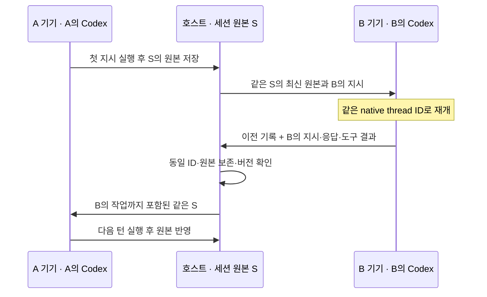

# hand-in-hand

**하나의 workspace, 하나의 AI 세션. 다음 차례는 내 AI로.**

hand-in-hand는 호스트 PC의 프로젝트와 Codex 세션을 여러 사람이 함께 이어서 사용하는 협업 프로토타입입니다. 동료가 내린 지시와 AI의 작업 결과를 같은 대화에서 확인하고, 자신의 기기에 연결한 Codex로 다음 작업을 요청합니다.

파일과 세션 원본은 호스트가 보관합니다. 참여자는 프로젝트 전체를 복제하지 않고 필요한 파일을 호스트 도구로 읽고 수정합니다. 기본 원격 연결은 **Tailscale Serve의 사설 HTTPS**입니다.

> 현재는 **Codex 전용 프로토타입**입니다. 같은 계정의 독립 실행기 두 개로 A → B → A를 검증했고, 사용자 테스트에서는 서로 다른 계정으로 보고된 실행기 사이의 대화 재개도 확인했습니다. **계정별 실제 할당량 차감과 전체 기기별 설치 과정은 별도 검증이 필요합니다.**

## 주요 기능

- **동일 세션 재개:** Codex의 같은 native thread ID와 원본 JSONL 기록을 이어받습니다.
- **이전 기록 보존 검사:** 호스트가 SHA-256, 버전, 기존 기록의 변경·누락 여부를 확인합니다.
- **참여자별 실행기:** 제출자의 기기에 연결한 Codex로 해당 지시를 실행합니다.
- **공유 작업 공간:** 호스트 파일 목록·읽기·쓰기와 파일 버전 충돌 검사를 지원합니다.
- **실시간 확인:** AI 응답, 도구 결과, 진행 상태와 단일 HTML 미리보기를 표시합니다.
- **Tailscale 연결:** 앱에서 사설 HTTPS 연결을 켜고 끄며 초대 링크에 사설 주소를 적용합니다.
- **참여 관리:** 일회용 초대·실행기 연결 코드, 참여 권한 회수, 작업 중단과 기록 보관을 지원합니다.

여러 사람이 지시를 제출할 수 있지만 **AI 실행은 한 번에 한 턴씩, 제출 순서대로** 진행합니다. 각 실행기는 자기 차례 직전에 최신 세션 원본을 적용합니다.

## 준비 사항

| 항목 | 필요 조건 |
| --- | --- |
| Node.js | 22 이상. 검증 환경은 24.11.1 |
| Codex | 공식 Codex CLI 설치와 본인 계정 로그인. 검증 버전은 0.153.4 |
| Tailscale | 원격 협업에 참여하는 두 기기 모두 설치·로그인 |
| 호스트 PC | 프로젝트와 hand-in-hand를 실행한 상태로 유지 |

npm 외부 의존성이 없어 별도의 `npm install`은 필요하지 않습니다. 현재 확인한 운영체제는 Windows입니다. Codex의 실험적 App Server 인터페이스를 사용하므로 CLI 버전이 달라지면 재검증이 필요합니다.

**ChatGPT 계정 로그인만 지원하며 API 키 인증은 차단합니다.** 현재 연결기는 공식 Codex의 로컬 `auth.json`에서 로그인 상태를 읽습니다. OS 자격 증명 저장소만 사용하는 환경에서는 `codex -c cli_auth_credentials_store="file" login`으로 파일 저장 방식에 로그인하세요. 접근 토큰은 같은 기기의 실행기에 메모리로만 전달하며 호스트에 전송하지 않습니다.

각 연결기는 자체 `codex-runtime/` 폴더에 세션·DB·쓰기 잠금을 저장합니다. Codex 데스크톱 앱의 기본 저장소와 충돌하지 않으며, 공유하는 native 세션 ID와 대화 원문은 유지합니다. 로그인 정보나 기본 Codex 설정을 이 폴더에 복제하지 않습니다.

## 빠른 시작: 호스트

Tailscale 앱에 로그인하고 연결한 뒤 터미널에서 실행합니다.

```powershell
git clone https://github.com/sonic240612/hand-in-hand.git
cd hand-in-hand
codex login
npm start -- --tailscale
```

1. 호스트 PC에서 [http://127.0.0.1:4317](http://127.0.0.1:4317)을 엽니다.
2. 상단에서 **Tailscale 연결됨**을 확인합니다. 처음 HTTPS를 사용하는 네트워크라면 앱에 표시된 Tailscale 관리 링크에서 허용한 뒤 다시 연결합니다.
3. **내 Codex 연결 → 이 PC의 Codex 연결**을 누릅니다.
4. 동료의 Tailscale 기기 접근을 준비하고 **초대하기**로 세션 링크를 만듭니다.
5. 지시를 입력하면 실제 Codex가 공유 프로젝트에서 작업합니다.

기본 공유 폴더는 `workspace/`입니다. 포함된 `index.html`은 AI가 수정할 수 있는 샘플입니다. 다른 프로젝트를 사용하려면 폴더를 지정합니다.

```powershell
npm start -- --tailscale --workspace C:\Workspace\my-project
```

`npm start`만 실행하면 Tailscale 상태를 확인하고, 화면의 **Tailscale 설정 → Tailscale 연결 켜기**에서 사설 연결을 시작할 수 있습니다.

## 동료 초대와 참여

**Tailscale 기기 접근 권한과 hand-in-hand 세션 초대는 각각 필요합니다.** 세션 링크만으로 Tailscale 접근 권한이 생기지는 않습니다.

1. 동료도 자신의 PC에서 Tailscale에 로그인합니다.
2. 서로 다른 Tailscale 네트워크라면 호스트가 [Tailscale 기기 관리](https://login.tailscale.com/admin/machines)에서 이 PC를 공유하고, 동료가 기기 공유 초대를 수락합니다. 같은 네트워크라면 해당 기기의 HTTPS 포트에 접근할 수 있어야 합니다.
3. 동료에게 hand-in-hand의 **초대하기**에서 생성한 세션 링크를 전달합니다.
4. 동료가 링크를 열어 이름을 입력하고 **내 Codex 연결**에서 연결 코드를 확인합니다.
5. 동료의 PC에서 공식 `codex login`을 완료하고 연결 프로그램을 실행합니다. 아래 주소는 화면에 표시된 실제 주소로 바꿉니다.

```powershell
npm run agent -- --host https://호스트.네트워크.ts.net:8443
```

프로그램이 물으면 연결 코드를 입력합니다. 이후 브라우저의 같은 세션에서 지시합니다. 실행기를 다시 시작할 때는 `--resume`을 덧붙입니다.

초대 링크는 **24시간·1회**, 실행기 연결 코드는 **10분·1회** 사용합니다. 링크를 받은 사람에게 참여 권한을 주는 방식이므로 초대할 사람에게만 전달하세요. 이미 전달된 기록은 권한 회수 후에도 회수할 수 없습니다.

프로젝트 전체 대신 참여자 연결 프로그램만 전달할 수도 있습니다.

```powershell
powershell -NoProfile -File scripts/package-agent.ps1
```

생성되는 `dist/hand-in-hand-agent.zip`에는 실행기 코드와 사용 안내만 포함됩니다. 프로젝트 파일·로그인 정보·세션 원본은 포함하지 않습니다. 자세한 내용은 [참여자 안내](AGENT-README.md)와 [Tailscale 설정·문제 해결](docs/TAILSCALE.md)을 참고하세요.

## 동일 세션이 이어지는 방식



예를 들어 A가 “강조색은 초록색으로 해줘”라고 한 뒤 B가 “그 조건대로 페이지를 수정해줘”라고 요청하면, B의 Codex가 이전 지시와 도구 결과를 이어받는 것이 핵심입니다. 별도 대화를 만들고 인계 요약을 넣는 방식으로 동일 세션을 대신하지 않습니다.

모든 파일 도구는 호스트에서 실행합니다. AI의 로컬 셸·개인 앱·플러그인·MCP 접근은 끄고 명시한 공유 도구를 제공합니다. 계정이 바뀌었을 때 공급자가 원본 재개를 거절하면 실행을 멈추며, 요약이나 새 대화로 자동 대체하지 않습니다.

## 실행 옵션

| 옵션 | 용도 |
| --- | --- |
| `--tailscale` | 시작 시 Tailscale Serve 연결 활성화 |
| `--tailscale-port 9443` | 사설 HTTPS 포트 변경. 기본값 8443 |
| `--workspace 경로` | 공유할 프로젝트 폴더 지정 |
| `--port 4317` | 로컬 앱 포트 지정 |
| `--data 경로` | 호스트 상태 저장 위치 지정. 기본값 `.hih` |
| `--no-tailscale` | Tailscale 상태 확인 없이 로컬 모드 실행 |

기존 Tailscale 서비스와 포트가 충돌하면 덮어쓰지 않습니다. 인터넷 공개 기능인 Funnel은 이 모드에서 사용하지 않습니다. Tailscale 개인 사용자 식별 헤더가 없는 태그 기기의 접속은 지원하지 않습니다.

LAN 전용 연결과 자체 HTTPS 중계 코드는 선택 기능으로 남아 있습니다. 자체 공용 중계 서버는 배포되어 있지 않으며 기본 Tailscale 사용에는 필요하지 않습니다. [별도 연결 방식](docs/REMOTE-ACCESS.md)

## 검증

```powershell
npm test
```

2026-09-11 기준 **자동 테스트 24개 통과**. 세션 원본 보존, 대기열, 초대·실행기 권한, 파일 경로·버전 검사, 중계, Tailscale, 실행 저장소 격리, API 키 차단, 실행 전 충돌 복구와 중복 재시도를 검사합니다. 자동 테스트는 실제 AI를 호출하지 않습니다.

실제 Codex로 A → B → A를 확인하려면 다음 명령을 실행합니다. 현재 로그인 계정으로 AI 턴 3개를 실행하므로 **해당 계정의 사용량을 소비합니다.**

```powershell
npm run test:live
```

Tailscale 연결 후 기존 소유자 권한으로 HTTPS·동일 세션·SSE를 읽기 전용 검증할 수 있습니다.

```powershell
node scripts/check-tailscale.mjs
```

실제 검증에서는 같은 계정의 독립 실행기 두 개로 대화 속 조건, 이전 도구 결과, 동료가 수정한 조건의 연속성을 확인했습니다. 이후 사용자 테스트에서 다른 계정의 참여자가 보낸 두 메시지를 호스트 계정이 같은 native 세션에서 정확히 회상했고, v3 → v4 저장 시 기존 원문 전체가 보존되었습니다. 실제 Tailscale Serve의 HTTPS·실시간 응답도 확인했습니다. 각 기기의 설치 과정과 공급자 측 사용량 차감은 별도 확인이 필요합니다. [검증 기록](docs/PROTOTYPE-VALIDATION.md)

`active writer` 오류가 AI 실행 전에 발생하면 기존 기록을 유지한 채 **다시 실행**할 수 있습니다. 구버전에서 같은 오류로 세션이 차단된 경우, 시작 전 거절과 원문 보존을 확인할 수 있는 상태만 자동 백업 후 복구합니다. 이미 AI가 실행됐거나 저장 상태가 불확실하면 계속 차단합니다.

## 현재 범위와 데이터 보관

- 텍스트 파일은 256 KiB, 세션 원본은 16 MiB, AI 한 턴은 5분으로 제한합니다.
- JavaScript는 `node --check`, JSON은 파싱, HTML은 기본 경계 검사만 수행합니다. 임의 셸이나 프로젝트 전체 테스트 실행은 지원하지 않습니다.
- 미리보기는 호스트의 단일 `index.html`을 샌드박스 iframe에 표시합니다.
- 컨텍스트 압축·이미지·Claude 혼합 실행은 현재 검증 범위 밖입니다. 기록 압축이 감지되면 다음 실행을 중지합니다.
- 원본 보존은 확인하지만 공급자 내부 캐시 공유나 이전 기록의 입력 토큰 면제를 보장하지 않습니다.
- 실행 중 강제 종료·연결 장애로 기록 저장이 불확실하면 다음 턴을 차단합니다. 화면의 중단 기능을 사용하고, 미확정 작업은 호스트 기록과 실행기의 복구 파일을 확인하세요.
- 새 세션은 기존 기록을 보관한 뒤 시작합니다. 프로젝트 파일을 자동으로 되돌리지는 않습니다.

호스트 상태는 `.hih/`, 참여자 실행기 상태는 `.hih-agent/`에 저장합니다. 이 폴더에는 접속 권한과 공유 세션 원본이 있으므로 전달하거나 커밋하지 마세요. Codex 로그인 정보는 공식 Codex의 로컬 저장소에 남습니다. 세션 자료는 참여자의 실행기와 해당 AI 공급자에도 전달됩니다.

## 프로젝트 구성

| 경로 | 역할 |
| --- | --- |
| `src/server.mjs` | 호스트 API, 인증, 대기열, 실시간 스트림 |
| `src/session.mjs` | 단일 세션 상태와 원본·버전 검사 |
| `src/agent.mjs`, `src/codex-rpc.mjs` | 참여자 실행기와 Codex App Server 연결 |
| `src/workspace.mjs` | 호스트 파일 접근·충돌 검사·검증 |
| `src/codex-runtime.mjs` | 실행 저장소 격리와 로컬 ChatGPT 로그인 연결 |
| `src/tailscale.mjs` | Tailscale 상태와 Serve 설정·해제 |
| `src/relay*.mjs` | 선택 기능인 자체 중계 |
| `public/` | 공유 대화·미리보기·연결 화면 |
| `workspace/` | 기본 샘플 프로젝트 |
| `test/`, `scripts/` | 자동·실제 검증과 실행기 패키징 |
| `docs/` | 사용 안내와 검증 기록 |

[제품 기획서](hand-in-hand_기획서.md) · [Tailscale 사용 안내](docs/TAILSCALE.md) · [참여자 연결 안내](AGENT-README.md)
