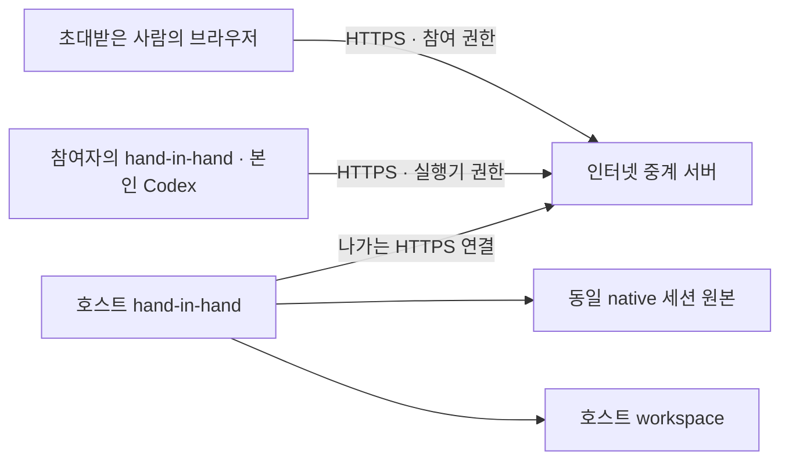

# VPN 설치 없는 원격 접속

**현재 기본 원격 접속은 [Tailscale](TAILSCALE.md)이다.** 이 문서는 선택 기능으로 보관한 자체 중계 방식이다. 이 자체 중계를 실제 서버에 배포하지 않았다. Tailscale 사용에는 아래의 자체 중계 설정이 필요 없다.

직접 연결은 참여자 → 호스트 PC로 통신한다. 같은 LAN에서는 호스트의 LAN 주소로 접근할 수 있다. 인터넷에서는 도달 가능한 공인 주소와 호스트 수신 포트가 필요하다. 공유기의 포트 전달 또는 양쪽에서 연결 가능한 공인 IPv6, 방화벽 허용과 HTTPS를 준비해야 한다. 통신사 공유 IPv4·회사망 정책 등에 따라 직접 연결이 불가능할 수 있으므로 앱 실행만으로 모든 네트워크에서 연결된다고 표시하지 않는다. 초대 권한 확인과 동일 세션 원본 보존은 연결 방식과 무관하게 호스트에서 처리한다.

현재 직접 수신은 기존 `--listen`으로 제공하는 LAN HTTP 경로까지 구현했다. 공용 HTTPS 직접 호스팅, 자동 포트 매핑, 외부 도달 가능성 검사는 아직 구현·검증하지 않았다. 근거: [Tailscale의 NAT 통과 설명](https://tailscale.com/blog/how-nat-traversal-works), [공유 주소 공간 RFC 6598](https://www.rfc-editor.org/info/rfc6598/).

hand-in-hand에 중계 연결 기능을 넣었다. 호스트·참여자에게 Tailscale 설치나 계정이 필요하지 않다. 호스트가 HTTPS 중계 서버로 나가는 연결을 만들고, 참여자는 중계 주소의 초대 링크를 브라우저로 연다. 자기 Codex를 쓰는 참여자는 기존 hand-in-hand 연결 프로그램을 실행한다.

**연결 코드는 구현·검증했으며, 인터넷 중계 서버는 아직 배포하지 않았다.** 실제 서비스 주소와 HTTPS 서버 한 곳을 운영해야 다른 장소에서 바로 접속할 수 있다. 사용자에게 서버 설치를 요구하는 제품이 아니라 서비스 운영자가 중계를 제공하는 방향이다. 현재 배포 단위는 중계 서버 하나에 호스트 하나다.

## 연결 구조



중계는 호스트가 보낸 대기 요청에 다음 작업을 전달하고, 호스트가 올린 응답 스트림을 참여자에게 보낸다. 파일·세션 데이터베이스는 호스트에 저장하며 중계 코드는 요청을 전달하는 동안만 메모리에 보관한다. **HTTPS 구간 암호화이며 종단 간 암호화는 아니다.** 중계 운영자는 전송 중인 공유 대화·파일·접속 권한을 볼 수 있는 신뢰 대상이다. 로그·트래픽 캡처를 별도로 설정하면 이 데이터가 남을 수 있다.

브라우저 요청과 참여자 실행기의 요청은 똑같은 호스트 세션 API로 들어간다. 네트워크 방식 변경으로 native thread ID나 이전 세션 원본을 바꾸지 않는다. 연결이 끊긴 변경 작업은 자동 재실행하지 않는다. 미확정 AI 턴은 기존 세션 복구 규칙을 따른다.

## 초대받은 사람의 사용 순서

1. 호스트가 보낸 `https://중계주소/#invite=...` 링크를 연다.
2. 이름을 입력해 참여한다. 24시간 유효한 링크를 한 번 사용하면 참여 권한이 발급된다.
3. `내 Codex 연결`의 코드를 hand-in-hand 연결 프로그램에 입력한다.
4. 같은 대화에서 지시한다. 호스트 PC와 참여자 실행기는 켜 둔다.

참여자 실행 명령은 다음과 같다. Tailscale·VPN·포트 개방은 필요 없다.

```powershell
npm run agent -- --host https://중계주소
```

아직 프로그램은 Node.js와 공식 Codex CLI를 사용하는 형태다. 설치 파일 하나로 이 실행 환경을 묶고 중계 주소를 자동 제공하는 작업은 다음 제품화 단계다.

## 접근 권한

- 링크를 열기 전에도 정적 참여 화면은 보이지만, 초대에 참여하기 전에는 세션·파일 API가 401을 반환한다.
- 초대 링크는 무작위 256비트 코드이며 24시간·1회 사용이다. 현재는 **링크를 받은 사람에게 권한을 주는 방식**이고 특정 이메일에 묶인 초대는 아니다. 지정한 사람만 참여하도록 링크를 직접 전달해야 한다.
- 실행기 연결 코드는 별도이며 10분·1회 사용이다. 중계 호스트 키와 참여자 토큰도 구분한다.
- 중계 요청은 전용 loopback 수신기로 처리한다. 소켓 주소가 127.0.0.1이어도 원격 요청임을 유지하므로 호스트 소유자 자동 로그인·호스트 Codex 연결이 허용되지 않는다.
- 참여 권한을 회수하면 브라우저와 실행기의 후속 접근을 차단하고 실시간 연결을 종료한다. 이미 받은 자료는 회수할 수 없다.

## 서비스 운영자: 배포 준비

호스트 PC의 공유기 설정은 건드리지 않는다. 중계 서버에는 도메인·유효한 HTTPS 인증서·Node.js 22 이상이 필요하다. 아래는 같은 중계 서버에서 Caddy가 HTTPS를 담당하는 예다.

먼저 호스트에서 키를 생성한다. 기존 파일은 덮어쓰지 않고, 키 내용을 터미널에 출력하지 않는다.

```powershell
node scripts/init-relay-key.mjs
```

생성된 `.hih/relay.key`를 중계 서버 관리자에게 안전하게 전달한다. 이 키는 초대받는 참여자에게 전달하지 않는다. 중계 서버에는 전체 workspace 대신 `src/relay.mjs`, 키 파일과 Node.js만 있으면 된다. 프로젝트·Codex 로그인 파일·세션 원본을 서버로 복사할 필요가 없다.

중계 서버에서 실제 도메인과 키 경로로 다음 명령을 실행한다.

```text
node src/relay.mjs --key-file /secure/relay.key --public-url https://collab.example.com
```

중계는 기본적으로 서버 내부 `127.0.0.1:4318`에서만 수신한다. `deploy/Caddyfile.example`의 도메인을 실제 DNS가 이 서버를 가리키는 도메인으로 바꾸고 Caddy에 적용한다. 서버의 외부 HTTPS 포트가 연결되어야 한다. 요청·응답 본문 로깅이나 요청 버퍼링은 켜지 않는다.

호스트에서는 기존 실행을 종료한 뒤, 같은 데이터·workspace 경로로 실행한다.

```powershell
npm start -- --relay https://collab.example.com --relay-key-file .hih/relay.key
```

호스트 화면의 **인터넷 연결됨**을 확인하고 초대 링크를 만들면 인터넷 주소가 자동으로 들어간다. 중계 연결이 없으면 로컬 주소임을 화면에 표시한다. 키를 바꿀 때는 중계와 호스트를 모두 종료하고 양쪽 파일을 교체한다.

환경변수 `HIH_RELAY_URL`, `HIH_RELAY_KEY_FILE`도 지원한다. `HIH_RELAY_KEY`에 키 자체를 지정할 수도 있지만 명령 기록에 비밀이 남지 않도록 키 파일 사용을 권장한다.

## 개발자: 한 PC에서 중계 경로 검증

인터넷 배포 없이 통신 경로를 시험할 수 있다. 이 주소를 인터넷 접속 주소로 표시하지 않는다.

```powershell
# 터미널 1
node scripts/init-relay-key.mjs
npm run relay -- --key-file .hih/relay.key
```

```powershell
# 터미널 2: 기존 호스트를 종료한 뒤
npm start -- --relay http://127.0.0.1:4318 --relay-key-file .hih/relay.key
```

호스트 소유자 화면은 `http://127.0.0.1:4317`, 중계 참여 화면은 `http://127.0.0.1:4318`이다. 참여 화면에서 소유자를 자동 생성할 수 없어야 정상이다. 테스트 종료 후 기본 `npm start`로 실행하면 로컬 모드로 돌아온다.

`npm test`의 `test/relay.test.mjs`는 임시 workspace와 실제 HTTP 서버 두 개를 사용한다. 인증 없는 데이터 조회 거절, 원격 관리자 획득 차단, 위조 proxy 헤더, 일회용 초대, 실행기 연결, 동일 native 세션 저장, 실제 파일 수정, SSE 전송과 권한 회수를 검증한다. 실제 다른 기기·공용 HTTPS 주소의 왕복 통신은 배포 후 확인해야 한다.

## 현재 운영 범위

한 중계당 호스트 하나, 동시에 처리하는 요청 32개, 요청 본문 34 MiB·대기 본문 합계 68 MiB로 제한한다. 호스트가 오프라인이면 503으로 알린다. 인터넷 공개 운영에 필요한 사용자별 트래픽 제한·다중 호스트 관리·계정에 묶인 초대·운영 모니터링은 후속 범위다. 자체 P2P·NAT 탐색·종단 간 암호화는 아직 구현하지 않았다.

참고: [Node.js fetch](https://nodejs.org/api/globals.html#fetch), [Caddy reverse proxy와 스트리밍](https://caddyserver.com/docs/caddyfile/directives/reverse_proxy). Caddy는 SSE 응답을 즉시 전달하므로 이 예에서는 별도의 전체 응답 버퍼를 설정하지 않는다.
