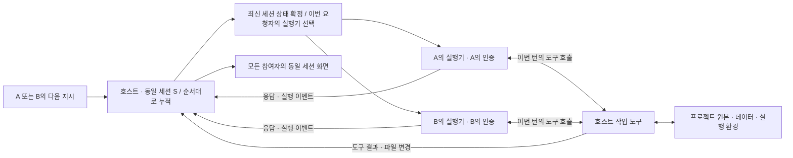

# hand-in-hand 기획서

**세션은 하나로 이어지고, 내 차례의 작업은 내 AI로 실행한다.**

| 항목 | 내용 |
| --- | --- |
| 문서 버전 | v0.2 · 동일 세션을 핵심 요구로 반영 |
| 작성일 / 공식 자료 확인일 | 2026-09-11 |
| 제품 형태 | 하나의 세션 상태를 여러 사람의 AI 계정으로 이어서 실행하는 협업 도구 |
| 초기 대상 | 서로 신뢰하는 2~5명의 소규모 프로젝트 팀 |
| 우선 검증 환경 | Windows PC 2대, 서로 다른 개인 계정, Codex 우선 |
| 문서 범위 | 제품 방향, 사용 흐름, 구현 구조, MVP, 검증 조건 |

이 문서의 기능·일정·수치는 **제안과 검증 목표**다. 실제 연동과 성능은 아직 검증하지 않았다. **사람이나 AI 계정이 바뀌어도 동일한 세션 데이터가 다음 실행에 적용되는 것**이 제품의 최우선 성립 조건이다. 개인별 사용량 분리와 함께 구현 착수 단계에서 검증한다.

## 1. 기획 배경

AI로 함께 프로젝트를 만들 때 협업의 흐름이 자주 끊긴다. 한 사람이 작업한 파일을 다른 사람이 받고, 실행 환경을 맞추고, 다른 AI 세션에 프로젝트를 다시 설명해야 한다. 코드 외에 데이터·이미지·모델·문서가 크면 파일을 옮기는 시간도 늘어난다. 상대방이 무엇을 작업하고 있는지, 결과물이 지금 어떤 모습인지 확인하기도 번거롭다.

GitHub를 이용하면 변경 이력을 관리할 수 있지만, 소규모 팀이 매번 커밋·푸시·풀·병합을 직접 처리하면서 AI 작업까지 이어가는 과정은 부담이 된다. hand-in-hand는 일상적인 공동 작업을 하나의 세션 안에서 진행하도록 만든다. GitHub 연결은 선택사항으로 두고, 변경 이력과 복구는 제품이 관리한다.

핵심 요구는 다음과 같다.

- 이전 사람이 내린 지시와 AI가 처리한 내용이 같은 세션에 누적되고, 다음 사람의 AI도 그 세션 상태에서 이어서 작업한다.
- 한 사람의 PC에 있는 프로젝트와 데이터를 기준으로 함께 작업한다.
- 초대받은 사람은 프로젝트 전체를 내려받거나 같은 개발 환경을 설치하지 않고 참여한다.
- 각자가 요청한 AI 작업은 각자 연결한 계정의 사용량으로 처리한다.
- 작업 지시, 진행 상황, 변경 파일, 실행 결과를 같은 화면에서 확인한다.
- 사람이 바뀔 때 새 대화를 만들거나 프로젝트를 다시 설명하는 절차가 없어야 한다.

## 2. 제품 정의와 핵심 원칙

**hand-in-hand는 호스트에 하나의 세션 원본과 워크스페이스를 유지하고, 매 차례의 요청자가 선택한 AI 계정으로 그 세션의 다음 턴을 실행하는 도구다.**

기준 PC를 **호스트**, 참여하는 사람의 기기를 **참여 기기**라고 부른다. 호스트 사용자도 자신의 AI 계정으로 참여하는 한 명의 작업자다.

| 원칙 | 제품에서의 의미 |
| --- | --- |
| 세션 원본은 하나 | 모든 참여자의 지시, AI 응답, 도구 호출과 결과, 결정, 작업 상태를 같은 순서로 누적한다. |
| 다음 턴은 직전 세션 상태에서 시작 | B의 AI는 A의 턴까지 반영한 상태로 실행하고, 다시 A가 실행하면 B의 턴까지 반영한다. |
| 프로젝트 원본은 한 곳에 | 파일과 대용량 데이터, 개발 서버와 테스트 환경은 호스트에 둔다. |
| 턴의 실행 계정은 요청자에게 연결 | 세션을 유지하면서 A의 턴은 A의 인증으로, B의 턴은 B의 인증으로 실행한다. |
| 에이전트 연결은 같은 세션을 실행하는 수단 | 공급자별 로컬 기록이 있다면 공통 세션에서 복원한 실행용 상태로 취급한다. 독립적인 대화 원본으로 삼지 않는다. |
| 변경은 추적하고 되돌릴 수 있게 | 누가 어떤 요청으로 무엇을 바꿨는지 기록한다. |
| 반복 설정을 최소화 | 폴더 선택, 초대, 에이전트 연결 후 바로 첫 작업을 시작하도록 한다. |

### ‘동일 세션’의 필수 동작

예를 들어 A가 “로그인은 이메일 방식으로 하고, 전화번호는 수집하지 말아줘”라고 지시하고 A의 AI가 화면을 만든다. B가 자신의 AI로 “거기에 입력 검증도 추가해줘”라고만 요청해도, B의 AI에는 A의 원래 지시와 응답, 작업 과정과 결과가 적용되어야 한다. A가 다시 “방금 추가한 검증의 오류 문구를 바꿔줘”라고 하면 B가 진행한 턴까지 이어져야 한다.

| 순서 | 세션에 추가되는 내용 | 실행 계정 | 다음 실행의 기준 |
| --- | --- | --- | --- |
| 1 | A의 지시 → AI의 응답·도구 실행·결과 | A | 세션 S의 1번 턴까지 |
| 2 | B의 후속 지시 → AI의 응답·도구 실행·결과 | B | 세션 S의 2번 턴까지 |
| 3 | A의 후속 지시 → AI의 응답·도구 실행·결과 | A | 세션 S의 3번 턴까지 |

이 동작에는 이전 지시의 원문과 수정·취소 내역, AI의 공개 응답, 도구 호출 인자와 결과, 첨부 자료, 파일 변경, 실패한 시도, 진행 중 상태가 포함된다. 작성자와 실행 계정도 보존해 “누가 무엇을 요청했는가”를 구분한다. 공통 타임라인에 보이는 기록은 다음 AI 실행에도 같은 세션 기록으로 적용되어야 한다.

파일 공유만 되거나, 서로 다른 대화를 한 화면에 모으거나, 새 AI에게 인계 요약만 제공하는 동작으로 이 요구를 충족했다고 판정하지 않는다. 세션 안의 과거 내용을 필요할 때 검색하는 기능도 다음 턴의 기본 세션 상태를 대신할 수 없다.

이는 **동일 세션 데이터의 연속성에 대한 제품 요구**이며, 어떤 공식 하네스에서 그대로 구현 가능한지는 아직 검증하지 않았다. 공급자 내부 세션 ID·캐시·비공개 추론 상태의 이전 가능 여부는 별도 확인 대상이다. 필요한 상태를 복원할 수 없는 조합을 요약 전달 방식으로 낮춰서 ‘동일 세션 지원’이라고 표시하지 않는다. 같은 데이터가 적용되더라도 서로 다른 모델의 답변 자체가 같아야 한다는 의미는 아니다.

## 3. 대상 사용자와 대표 사용 사례

| 사용자 | 현재 겪는 문제 | 기대하는 사용 경험 |
| --- | --- | --- |
| 친구와 웹서비스를 만드는 2인 팀 | 파일을 주고받고 각자 실행 환경을 맞추는 일이 번거롭다. | 한 PC에서 서버를 실행하고 각자 AI로 기능을 개발한다. |
| 개발자와 기획·디자인 담당자 | 코드 변경 과정과 실제 결과를 따로 확인한다. | 기획 수정 요청과 결과 미리보기를 같은 세션에서 확인한다. |
| 데이터가 많은 연구·분석 팀 | 큰 데이터를 복제하고 분석 환경을 다시 만든다. | 데이터가 있는 호스트에서 분석하고 필요한 결과만 공유한다. |
| 여러 기기를 사용하는 개인 | 기기를 바꿀 때 세션과 프로젝트를 다시 준비한다. | 같은 워크스페이스에 재접속해 기록을 보고 이어서 작업한다. |

초기에는 **서로 신뢰하는 두 사람이 만드는 웹 프로젝트**에 집중한다. 웹 프로젝트는 파일 변경, 테스트, 결과 미리보기까지 협업의 전체 흐름을 검증하기 쉽다. 데이터 분석과 더 많은 참여자는 이후 확장한다.

## 4. 사용 흐름

### 4.1 호스트가 작업공간 만들기

1. hand-in-hand에서 `작업공간 만들기`를 선택한다.
2. 사용할 프로젝트 폴더를 지정한다. 별도 데이터 폴더가 필요하면 읽기 전용으로 추가한다.
3. 공유 대상 파일과 제외할 항목을 확인한다.
4. 세션 이름을 입력하고 자신의 에이전트를 연결한다.
5. 참여자가 할 수 있는 작업 범위를 지정하고 초대 링크를 만든다.

처음 설정한 뒤에는 호스트 앱이 백그라운드에서 워크스페이스를 유지한다. 접속 가능 상태가 되려면 PC 전원, 절전 해제 상태, 네트워크 연결, 호스트 서비스 실행이 모두 필요하다. 앱은 이 상태를 한 화면에 표시하고 자동 시작과 절전 방지 설정을 제공한다.

### 4.2 초대받은 사람이 참여하기

1. 초대 링크를 열어 작업공간 이름, 호스트, 요청 권한을 확인한다.
2. 새 기기 등록과 호스트의 참여 승인을 거친다.
3. 기존 세션에 참여해 누적된 지시·응답·작업 기록과 현재 결과물을 확인한다.
4. AI 작업을 하려면 로컬 연결 프로그램을 설치하고 본인의 공식 에이전트에서 로그인한다.
5. 자신의 실행기가 최신 세션 상태를 적용했는지 확인한 뒤 같은 세션에 후속 지시를 입력한다.

정식 MVP의 목표는 다른 네트워크에서도 초대 링크로 참여하는 것이다. 기술 검증 단계는 같은 LAN 또는 사설 네트워크에서 먼저 진행한다. 에이전트 없이 보는 브라우저 전용 참여는 후속 기능으로 두어 첫 버전의 범위를 줄인다.

### 4.3 함께 작업하기

예를 들어 A가 “회원가입 화면을 만들어줘”를 요청하면 A의 계정으로 현재 세션의 다음 턴을 실행한다. B가 “그 화면에 입력 검증을 추가해줘”라고 요청하면 A의 지시·응답·도구 실행 결과까지 누적된 동일 세션에서 B의 계정으로 다음 턴을 실행한다. B가 A의 작업을 다시 설명하거나 다른 대화에 복사하지 않는다.

MVP는 **하나의 세션에서 활성 AI 턴을 하나씩 순서대로 실행**한다. 여러 참여자는 동시에 접속하고 지시를 대기열에 올릴 수 있다. 대기 중인 지시는 실행 직전에 앞선 턴까지 적용한다. 병렬 AI 실행은 이후 확장하되, 각 실행이 본 세션 버전과 결과 반영 순서를 관리하는 별도 설계가 필요하다.

### 4.4 이어받기와 재접속

새 참여자가 들어오거나 담당자가 바뀌면 **동일한 세션 ID와 누적 상태를 유지하고 다음 턴의 실행 계정만 바꾼다.** 예전에 연결한 실행기를 다시 사용할 때도 자신이 마지막으로 실행한 시점의 개인 기록에서 재개하지 않고, 다른 사람이 추가한 모든 턴을 먼저 적용한다.

참여 기기가 꺼지면 그 기기의 AI 실행은 중단된다. 호스트가 켜져 있어도 해당 참여자의 AI가 계속 실행된다고 보장하지 않는다. 세션 원본, 파일과 완료된 결과는 호스트에 남는다. 실행 중단은 중단 기록과 확인된 도구 결과를 공통 세션에 반영한 뒤 처리하며, 재접속 시 누락된 이벤트를 복구하고 최신 세션 적용 확인 후 실행을 허용한다.

## 5. 계정별 AI 사용량과 연동 전략

### 5.1 비용과 실행 주체

**사용량을 어느 계정에 부과할지는 실제로 AI 요청을 인증한 계정이 결정한다.** hand-in-hand 화면에서 작성자 이름만 바꾸는 것으로는 과금 주체가 바뀌지 않는다.

그래서 실행 단위를 `동일 세션의 최신 상태 + 이번 지시 → 요청자에게 연결된 실행기 → 해당 실행기의 인증 계정`으로 묶는다. **세션 소유자와 현재 턴의 사용량 부담 주체는 별개다.** 실행 전에 사용 모드를 표시하고, 다른 참여자의 계정으로 자동 전환하지 않는다.

| 모드 | 의미 | 제품 처리 |
| --- | --- | --- |
| 공식 에이전트의 개인 구독 | 공식 프로그램이 본인 계정으로 인증하고 해당 상품의 사용 조건을 적용한다. | 우선 검증할 핵심 경로다. 구독 지원 여부와 실행 방식을 공급자별로 확인한다. |
| 개인 API 키 | 본인 API 계정 또는 연결한 조직에 사용량이 부과된다. | 별도 선택 모드다. 기존 구독 할당량과 구분해 표시한다. |
| 팀이 제공하는 API 계정 | 조직의 공용 비용으로 실행한다. | 초기 범위에서 제외한다. |

작업별로 공급자, 연결 모드, 실행기, 실행 시간, 제공되는 토큰·사용량 정보를 기록한다. 공급자가 정확한 잔여량을 제공하지 않으면 `확인 불가`로 표시한다. API 키가 같은 조직에 속하면 청구가 개인별로 분리되지 않을 수 있으므로 실제 청구 단위도 함께 안내한다.

사용량 한도에 도달하면 해당 실행을 멈추거나 대기시킨다. 새 계정이나 다른 사람의 할당량으로 자동 우회하지 않는다. 요약·재시도·자동 후속 작업도 사용량을 쓰므로 요청자의 실행 예산에 포함한다.

### 5.2 공식 자료에서 확인한 범위

| 대상 | 확인된 사실 | hand-in-hand의 판단 |
| --- | --- | --- |
| Codex 인증 | ChatGPT 구독 로그인과 API 키 로그인을 지원하며, API 사용은 별도 사용량 과금이다. | 개인별 공식 인증을 유지한다. 프로그램 실행 방식별 구독 적용 범위는 PoC에서 확인한다. |
| Codex App Server | 세션 시작·재개, 실행 이벤트와 인증 상태를 다루는 인터페이스를 제공한다. | 개인 기기에서 실행하는 Codex와 화면을 연결하는 후보로 삼는다. |
| Codex / Claude Code MCP | 외부 도구 서버 연결을 지원한다. | 호스트의 파일·실행 기능을 원격 도구로 제공하는 공통 연결면으로 검토한다. |
| Claude Code 공식 바이너리 | 문서에 명시된 조건 아래 제품 내 실행 경로가 있으며, 최종 사용자가 공식 흐름으로 자신의 계정에 인증한다. | 수정하지 않은 공식 프로그램과 사용자 직접 인증을 유지하는 연동을 우선 검토한다. |
| Claude Agent SDK | 타사 제품의 claude.ai 로그인·할당량 제공은 사전 승인 없이는 허용하지 않는다고 안내한다. | SDK를 이용한 자체 에이전트는 개인 API 인증을 기준으로 검토한다. |

Codex의 인증·과금 구분은 [공식 인증 문서](https://learn.chatgpt.com/docs/auth), 세션·이벤트 연동은 [App Server 문서](https://learn.chatgpt.com/docs/app-server)를 기준으로 확인했다. 인증 문서는 CI/CD 같은 프로그램 기반 CLI 실행에 API 키 사용을 안내하므로, 구독 로그인을 지원한다는 사실만으로 모든 자동화·통합 실행에 구독 사용이 가능하다고 해석하지 않는다. 이 기능들이 다중 사용자 과금 분리와 원격 도구 실행을 완성해 주는 것은 아니며, 별도의 연결·검증이 필요하다.

호스트 도구 연결의 근거는 [Codex MCP 문서](https://learn.chatgpt.com/docs/extend/mcp?surface=cli)와 [Claude Code MCP 문서](https://code.claude.com/docs/en/mcp)다. MCP는 도구 호출을 연결하는 규약이므로, 세션 동기화·권한 관리·수정 충돌 처리는 hand-in-hand가 담당해야 한다.

Claude 공식 바이너리 경로는 변경하지 않은 프로그램 사용, 내장 인증 방식 유지, 사용자 직접 인증과 사용료 부담 등의 조건을 따른다. 자체 앱에서 구독 자격 증명을 수집하거나 대신 요청을 중계하는 방식과 구분한다. [Claude Code 이용·인증 조건](https://code.claude.com/docs/en/legal-and-compliance), [Agent SDK 안내](https://code.claude.com/docs/en/agent-sdk/overview).

### 5.3 연동 순서와 지원 판정

1. **Codex + Codex, 다른 계정:** A → B → A로 실행 계정을 바꿔도 같은 세션의 모든 선행 턴이 적용되는지 먼저 검증한다.
2. **공통 세션과 호스트 실행 결합:** 지시·응답·도구 결과·파일 변경을 하나의 세션에 기록하고 다음 실행에서 복원한다.
3. **Codex + Claude Code:** 동일한 세션 원본을 서로 다른 형식으로 복원하면서 빠지는 기록·역할·첨부·실행 상태가 없는지 검증한다. 호스트 MCP 연결만 성공한 경우에는 동일 세션 지원으로 판정하지 않는다.
4. **API 기반 공통 세션 실행:** 공식 하네스로 필수 세션 상태를 적용할 수 없을 때 검토할 별도 경로다. 기존 구독 사용 요구의 대체 달성으로 취급하지 않는다.

공식 프로그램과 연결하는 경우에도 실행 전 공통 세션 복원과 실행 후 기록 반영을 검증할 수 있어야 한다. 화면 표시만 연동되고 AI의 실제 대화 상태가 개인별로 따로 진행되는 어댑터는 핵심 요구를 충족하지 못한다. 입력·승인 일부가 원래 프로그램에 남더라도 이 기준은 유지한다.

**개인 API 키로 성공한 데모를 ‘기존 구독 할당량으로 협업 성공’으로 판정하지 않는다.** 구독 경로가 핵심 검증을 통과하지 못하면 제품 범위 재검토 사항으로 남긴다.

## 6. 시스템 구조 제안

### 6.1 중심 구조: 단일 세션 엔진 + 참여자별 실행 연결

호스트의 세션 엔진이 **누적 기록, 현재 실행 상태, 턴 순서의 기준**을 갖는다. 참여자별 실행기는 이번 턴을 처리할 때 동일한 세션 상태를 적용받고, 생성한 응답·도구 호출·결과를 같은 원본에 추가한다. 프로젝트의 읽기·수정·테스트도 이 세션의 작업으로 호스트에서 수행한다.

AI 인증을 각 참여 기기에 유지하는 배치를 우선 검토하되, 단일 세션을 복원·실행할 수 있다는 검증을 전제로 한다. 실행기의 물리적 위치보다 세션 연속성과 개인별 사용량 분리를 우선한다.

도식은 논리적인 역할 구분이다. A 기기와 호스트는 같은 PC일 수 있고, MVP에서는 A와 B 중 이번 턴의 실행기 하나만 활성화한다. 모델 호출은 선택한 실행기의 본인 인증으로 처리한다. 인터넷 연결에서는 세션·도구·이벤트 트래픽이 암호화된 중계 경로를 이용할 수 있다.

| 구성 요소 | 책임 |
| --- | --- |
| Host Service | 워크스페이스 접근, 파일 버전 검사, 변경 반영, 명령 실행, 프로세스 관리 |
| Session Engine / Store | 단일 세션 ID, 원문 기록과 자료, 적용 중인 지시, 턴 상태와 순서, 영속 저장 관리 |
| Turn Coordinator | 다음 턴 시작 시 최신 상태 확정, 활성 실행 하나 유지, 요청자의 계정 연결, 중복 실행 방지 |
| Agent Adapter | 공통 세션을 실행 가능한 상태로 복원하고 적용 여부 확인, 생성된 기록 반영, 지원 불가 상태 판별 |
| Participant Client | 같은 세션의 지시 입력, 본인 실행기 연결, 동기화 상태·파일·결과 표시 |
| Session Materializer | 공통 기록으로 실행용 대화 상태 구성, 역할·순서·도구 호출과 결과·첨부·체크포인트 연결 보존 |
| Connection Service | 인터넷에서 호스트 찾기, 초대 연결, 필요한 암호화 트래픽 중계 |

### 6.2 호스트 도구의 최소 기능

| 도구 범주 | 동작 |
| --- | --- |
| 탐색 | 허용된 폴더 목록, 파일 메타데이터, 텍스트 검색 결과 제공 |
| 읽기 | 필요한 파일·구간만 읽고 파일 버전과 함께 반환 |
| 수정 | 읽었던 버전에 기반한 변경안을 제출하고 호스트가 검증 후 반영 |
| 실행 | 작업에 연결된 호스트 프로세스로 테스트·빌드·분석을 실행 |
| 결과 | 로그 조회, 산출물 미리보기, 허용한 개발 서버 연결 |
| 세션 | 세션 원본·현재 적용 상태·누락 이벤트 동기화, 과거 기록과 자료 조회 |

**원격 도구를 추가하는 것만으로 모든 내장 도구가 호스트에서 실행되지는 않는다.** 에이전트가 참여 기기의 로컬 파일이나 셸을 잘못 사용하지 않도록 연결 모드별 실행 경로를 제한하고 확인해야 한다. 지시문만으로 해결했다고 간주하지 않는다. 공식 설정과 실행 환경 격리로 이 경계를 만들 수 없는 연동은 지원 보류한다.

### 6.3 다른 배치 방식의 평가

| 방식 | 장점 | 부담 | 판단 |
| --- | --- | --- | --- |
| 단일 세션 엔진 + 참여 기기별 AI | 개인 인증을 본인 기기에 유지하고 프로젝트 복제를 줄인다. | 매 턴 공통 세션 복원, 원격 도구 경로 제어, 참여 기기의 연결이 필요하다. | 동일 세션 적용 검증을 전제로 한 우선 후보 |
| 단일 세션 엔진 + 호스트의 개인별 AI | 세션 원본과 에이전트·파일이 같은 호스트에 위치한다. | 계정별 격리, 세션 복원, 인증 보관, 호스트 신뢰와 공급자 조건 확인이 필요하다. | 동일 세션 적용을 위한 비교 후보 |
| 모든 기기에 폴더 동기화 | 기존 로컬 에이전트를 활용하기 쉽다. | 파일 복제, 개발 환경 중복, 동기화 충돌이 생긴다. | 핵심 방향에서 제외 |

## 7. 동시 작업과 변경 충돌

동시 접속과 AI의 동시 실행을 구분한다. **MVP는 같은 세션에 여러 사람이 참여하되 AI 턴은 직전 턴의 상태를 이어받아 하나씩 실행한다.** 파일이 서로 달라도 앞선 턴이 끝나기 전에 다음 AI 턴을 시작하면 그 결과를 아직 알 수 없으므로, 처음부터 ‘동일한 최신 상태로 동시에 실행’한다고 약속하지 않는다.

| 단계 | 허용 범위 | 충돌 처리 |
| --- | --- | --- |
| 기술 검증 | A → B → A가 동일 세션에서 차례로 실행 | 세션 버전 확인과 턴 단위 대기열 |
| MVP | 여러 지시 접수, 활성 AI 턴 하나, 다음 지시는 직전 턴 확정 후 실행 | 단일 세션 실행 잠금, 파일 버전 검사, 중단 상태 확정 |
| 확장 | 명시된 세션 버전을 기준으로 여러 작업을 호스트 격리 환경에서 실행 | 인과 순서·세션 결과 반영·파일 통합을 함께 검증하고 후속 턴 전에 필요한 동기화 수행 |

MVP에서 파일 변경은 다음 규칙을 따른다.

1. 에이전트가 파일을 읽을 때 내용과 버전을 함께 받는다.
2. 변경안을 제출할 때 기준 버전과 수정할 파일 목록을 보낸다.
3. 호스트가 권한·예약 상태·현재 버전을 확인한다.
4. 버전이 같으면 변경 이력을 남기고 반영한다.
5. 다르면 자동 덮어쓰기 대신 `최신 변경 확인 필요` 상태로 돌린다.

서로 다른 파일도 API 규격·설정·의존성에서 충돌할 수 있다. 반영 뒤 관련 검증을 수행하고, 검증한 파일 버전과 결과를 함께 남긴다. 다른 작업이 코드를 바꾸면 이전 테스트 결과를 현재 상태의 검증으로 표시하지 않는다.

셸 명령은 여러 파일을 바꿀 수 있으므로 파일 예약만으로 통제할 수 없다. **MVP에서는 쓰기 가능성이 있는 명령 실행 동안 워크스페이스 전체 쓰기를 잠그고, 동시 실행이 필요하면 호스트 내부 격리 환경을 사용한다.** ‘테스트’라는 이름만으로 읽기 전용 명령이라고 가정하지 않는다.

호스트의 외부 편집기에서 발생한 변경도 감지하고 버전을 갱신한다. 외부 프로그램의 쓰기를 완전히 막는다고 보장하지 않으며, 변경 반영 직전에 다시 검사한다. 복구는 뒤따른 타인의 작업을 지우는 전체 되돌리기보다 해당 변경의 역패치를 먼저 검토한다. 충돌하면 사용자에게 비교 화면을 제공한다.

## 8. 동일 세션 데이터의 유지와 적용

### 8.1 세션 원본

공통 세션은 호스트에 단 하나의 원본을 둔다. 다음 데이터는 특정 참여자나 에이전트의 개인 대화에만 남겨두지 않고 해당 세션에 기록한다.

| 데이터 | 보존할 내용 |
| --- | --- |
| 사용자 지시 | 원문, 작성자, 입력 순서, 참조한 턴, 수정·취소 내역 |
| AI 응답 | 공개 응답 원문, 실행 계정과 에이전트, 생성 순서, 완료·중단 상태 |
| 도구 호출과 결과 | 도구 이름·인자, 호출과 결과의 연결, 출력·오류, 실행 식별자 |
| 첨부·참조 자료 | 원본 또는 변경되지 않는 내용 참조, 자료 버전, 이미지 등 입력 자료 |
| 프로젝트 변경 | 변경 전후 파일 버전, diff, 실행 결과와의 연결 |
| 세션 작업 상태 | 목표, 계획, 남은 작업, 진행 중 프로세스, 실패·중단과 미완료 호출 |
| 적용 중인 규칙 | 프로젝트 지시, 합의한 제약, 변경 이력과 적용 버전 |

과거에 파일을 읽은 결과와 현재 파일의 내용은 별개로 보존한다. 이후 파일이 바뀌었다고 과거 도구 출력까지 현재 내용으로 대체하면 원래 세션의 의미가 바뀐다. 큰 출력은 호스트에 원본을 보관하고 해당 내용의 버전과 참조를 기록한다.

인증 자격 증명과 권한은 대화 기록과 분리한다. 이전 사용자의 승인을 다음 사용자에게 자동 승계하지 않는다. 모든 실행에 같은 프로젝트 지시와 기록을 적용하되, 현재 실행자의 권한과 공급자 제약은 별도로 확인한다.

### 8.2 다음 턴을 실행하는 절차

1. 호스트가 직전 턴의 응답·도구 결과·파일 변경·완료 또는 중단 상태를 기록하고 세션 버전을 확정한다.
2. 대기 중인 다음 지시의 작성자와 실행 계정을 확인한다.
3. 선택된 실행기에 같은 세션의 현재 상태를 복원한다. 처음 연결한 실행기는 전체 누적 상태를 적용하고, 재연결 실행기는 이미 적용한 기록을 검증한 뒤 누락된 턴을 순서대로 추가한다.
4. 어댑터가 세션 ID, 적용 버전, 필요한 기록·자료의 대응 관계를 확인한다. 일부 기록을 수용하지 못하면 실행 전에 지원 불가 상태로 표시한다.
5. 새 지시를 같은 세션의 다음 턴으로 실행한다. 사용자 지시, AI 응답, 도구 결과의 역할과 순서를 보존하며, 과거 내용을 하나의 새 사용자 메시지로 뭉쳐 붙이는 방식은 동등한 복원으로 간주하지 않는다.
6. 생성되는 응답과 실행 이벤트를 공통 세션에 기록하고, 다음 턴의 기준 상태로 확정한다.

공급자 내부 세션 ID가 필요하면 공통 세션 ID와의 매핑을 관리한다. ID 문자열이 같다는 사실만으로 연속성을 판단하지 않으며, 실제 실행에 적용된 데이터와 후속 행동을 확인한다. 반대로 내부 ID가 다르다는 이유로 공통 세션 원본을 여러 개로 분리하지 않는다.

### 8.3 하네스 차이와 긴 세션

어댑터는 지시의 역할·순서, 도구 호출과 결과의 연결, 첨부 자료, 현재 작업 상태를 보존할 수 있어야 한다. 공식 인터페이스에서 내보내거나 복원할 수 없는 필수 상태가 있으면 그 계정·하네스 조합의 동일 세션 실행은 미지원으로 남긴다. 대화 텍스트를 읽을 수 있다는 사실만으로 실행 상태까지 복원할 수 있다고 가정하지 않는다.

긴 세션의 압축도 개인 에이전트마다 따로 수행하지 않는 것을 목표로 한다. 압축이 필요하면 세션 공통의 체크포인트와 그 이후 기록을 정하고 모든 실행기가 같은 기준을 적용해야 한다. 원본 기록은 보존한다. 요약은 압축된 실행 상태의 일부가 될 수 있지만, 계정을 바꿀 때 임의로 만든 인계 요약으로 세션을 대체하지 않는다.

MVP는 우선 압축 없이 지원 실행기 모두의 입력 한도에 들어가는 세션에서 연속성을 검증한다. 세션이 한도를 넘거나 공급자 내부의 독자적인 압축을 확인·제어할 수 없어 상태 일치를 보장할 수 없으면, 이를 알리고 해당 실행을 보류한다. 긴 세션 지원을 검증하기 전까지 무제한 이어가기 기능으로 표시하지 않는다.

### 8.4 토큰 절감의 위치

우선순위는 **동일 세션의 유지 → 각자의 사용량으로 실행 → 반복 분석 비용 최적화**다. 토큰 절감을 위해 이전 지시나 작업 기록을 임의로 생략해 핵심 요구를 약화하지 않는다.

같은 세션을 유지해도 공급자나 계정 전환 시 입력 토큰 비용이 다시 발생할 수 있다. 세션 데이터의 연속성과 공급자의 캐시·과금 방식은 별개로 검증한다. 비교 측정에는 세션 복원 비용, 압축 비용, 첫 유효 변경까지의 시간과 결과 품질을 모두 포함한다.

## 9. 파일·데이터·네트워크

### 9.1 파일을 옮기는 범위

프로젝트 전체와 대용량 원본 데이터는 호스트에 둔다. 참여 기기에는 실행에 필요한 세션 데이터·참조 자료, 요청한 파일 구간, 미리보기, 로그와 명시적으로 다운로드한 산출물을 전달한다. 프로젝트 전체 복제를 피하는 것과 AI 실행기에 세션 데이터를 적용하는 것은 별개의 문제다. 데이터 분석은 호스트에서 실행하고 필요한 결과를 가져오되, 해당 도구의 실제 결과 기록은 공통 세션에 보존한다.

참여자가 새 자료를 올릴 때는 파일 크기·전송 상태·저장 위치를 표시하고 임시 수신 후 검증해 반영한다. 이름 충돌 시 자동 덮어쓰지 않는다. 대용량 전송은 재개 가능한 방식으로 설계한다.

공유 데이터 폴더는 기본 읽기 전용으로 연결하고 산출물은 별도 폴더에 쓴다. 호스트에 원본을 유지해도 AI가 읽은 내용은 참여 기기와 선택한 AI 공급자로 전달될 수 있다. 화면에서 이 데이터 흐름과 공유 범위를 확인할 수 있게 한다.

### 9.2 LocalSend에서 활용할 부분

LocalSend 프로토콜은 외부 서버 없는 REST 통신, 기기 발견, 파일 전송을 목표로 한다. 같은 네트워크의 기기 탐색과 간편한 파일 전달 경험을 참고하기에 적합하다. [LocalSend 공식 프로토콜](https://github.com/localsend/protocol/blob/main/README.md).

hand-in-hand에는 추가로 지속적인 작업 이벤트, 인증된 원격 실행, 파일 버전 관리, 권한 회수, 인터넷 연결이 필요하다. 따라서 **세션 서비스와 호스트 도구를 중심에 두고, LocalSend의 탐색·전송 경험을 참고하는 방식**을 권장한다. 실제 코드를 재사용할 경우에는 해당 구성 요소의 라이선스와 유지보수 범위를 검토한다.

### 9.3 연결 전략

| 단계 | 방식 | 사용자 경험과 범위 |
| --- | --- | --- |
| 로컬 PoC | LAN에서 인증된 HTTPS / WebSocket 연결 | 직접 연결 코드 또는 로컬 초대 링크 |
| 원격 PoC | Tailscale 같은 기존 사설 네트워크 활용 | 별도 네트워크 설정이 필요한 내부 검증용 |
| MVP | 앱 안의 초대·연결 서비스와 암호화 터널 | 포트포워딩 없이 외부 네트워크에서 참여 |
| 확장 | 직접 연결 우선, 실패하면 중계 | 지연과 중계 트래픽 비용 최적화 |

Tailscale은 직접 연결과 중계 연결을 제공하며 양쪽 모두 종단 간 암호화를 사용한다. 원격 PoC의 네트워크 불확실성을 줄이는 후보로 삼는다. 별도 제품 설치가 필요한 PoC와 hand-in-hand의 최종 초대 경험은 구분한다. [Tailscale 연결 구조](https://tailscale.com/docs/reference/connection-types).

인터넷 MVP는 우선 검증된 터널 구성 요소를 이용한 중계 연결로 시작할 수 있다. 자체 NAT 통과 기술이나 암호 프로토콜을 새로 만들지는 않는다. 초대 링크에는 만료·사용 횟수 제한을 두고, 처음 등록한 참여 기기의 인증 정보로 후속 연결을 수행한다.

중계 서버는 연결 메타데이터와 암호화된 트래픽을 처리하며 프로젝트 파일의 영구 저장소 역할을 하지 않도록 설계한다. 종단 간 암호화는 별도로 구현·검증해야 하는 목표다. 호스트와 중계 서버 사이에 TLS만 적용한 상태를 종단 간 암호화라고 표시하지 않는다.

## 10. 주요 화면

### 작업공간 목록

작업공간 이름, 호스트 연결 상태, 참여자, 진행 중인 작업, 마지막 결과물을 보여준다. 호스트 오프라인·절전·실행기 연결 해제를 구분한다.

### 협업 세션

| 영역 | 주요 내용 |
| --- | --- |
| 상단 | 세션 이름, 호스트 상태, 참여자, 현재 차례, 다음 요청, 초대, 권한 |
| 왼쪽 | 프로젝트 파일, 공유 데이터, 작업 목록 |
| 가운데 | A → B → A처럼 작성자와 실행 계정이 바뀌어도 이어지는 하나의 대화·작업 타임라인 |
| 오른쪽 | 결과 미리보기, 변경 비교, 로그, 결정 사항 |
| 입력 영역 | 같은 세션에 보낼 다음 지시, 실행할 내 에이전트, 구독/API 모드, 세션 적용 상태 |

각 작업 카드에는 `요청자 · 에이전트 · 사용 모드 · 상태 · 관련 파일 · 결과`를 표시한다. `세션 적용 중`, `진행 중`, `차례 대기`, `승인 필요`, `연결 끊김`, `세션 적용 불가`, `사용량 한도`, `완료`, `실패`를 서로 구분한다. 세션 데이터 동기화가 완료되지 않은 실행기에 새 턴을 보내지 않는다.

타임라인에는 공식 인터페이스로 제공되는 응답, 도구 동작, 로그와 결과를 표시한다. 공급자가 공개하지 않는 내부 추론이나 다른 개인 세션을 수집하는 기능은 포함하지 않는다.

### 결과 미리보기

웹 프로젝트는 호스트 개발 서버의 허용된 포트만 인증된 연결로 공유한다. HTTP뿐 아니라 개발 서버의 갱신용 WebSocket도 처리한다. 임의의 호스트 포트에 접근할 수 있는 프록시로 만들지 않는다.

이미지·문서·분석 산출물은 파일별 미리보기로 보여준다. 실행 결과에 기준 파일 버전을 표시해 현재 코드와 이전 산출물을 혼동하지 않게 한다. 모든 종류의 데스크톱 앱 화면 공유는 후속 범위로 둔다.

## 11. MVP 범위와 제외 범위

| 우선순위 | 기능 | 완료 조건 |
| --- | --- | --- |
| P0 · 최우선 착수 조건 | 동일 세션의 계정 교대 실행 | A → B → A에서 앞선 지시·응답·도구 결과·작업 상태가 실제 다음 실행에 적용됨 |
| P0 · 착수 조건 | 개인별 공식 에이전트 연동 | 동일 세션을 유지하면서 이번 턴의 실행과 사용 주체를 요청자 계정으로 구분 |
| P0 | 단일 호스트 워크스페이스 | 프로젝트 전체 복제 없이 파일 검색·조회·변경 가능 |
| P0 | 초대와 권한 회수 | 외부 네트워크 기기 참여, 만료된 초대 차단, 퇴장 후 접근 차단 |
| P0 | 단일 세션 원본과 타임라인 | 두 기기의 기록과 각 AI 실행에 적용되는 세션이 같은 순서·버전을 따름 |
| P0 | 변경 충돌 제어 | 오래된 파일 버전의 쓰기 거절, 명령 실행과 파일 수정 조정 |
| P0 | 실행과 미리보기 | 호스트에서 테스트·개발 서버 실행, 양쪽에서 결과 확인 |
| P0 | 턴 순서와 세션 복원 | 활성 AI 턴 하나, 최신 세션 복원 확인 후 다음 지시 실행, 독립 대화로의 자동 분기 없음 |
| P0 | 기록과 재접속 | 호스트 재시작 후 작업 상태 복원, 중복 요청의 재실행 방지 |
| P1 | Claude Code 혼합 협업 | Codex와 교대할 때도 같은 세션 데이터의 역할·순서·실행 상태를 적용. 복원이 불가능하면 지원 보류 |
| P1 | 파일 업로드와 산출물 다운로드 | 선택 파일만 전송, 큰 전송의 중단·재개 처리 |
| P1 | 브라우저 관찰 모드 | 실행기 설치 없이 허용된 기록·미리보기 열람 |
| P2 | 격리된 병렬 실행 | 여러 작업을 호스트 내부 작업 환경에서 동시에 실행·통합 |

MVP의 플랫폼은 우선 Windows로 한정하고, 두 참여자 기준으로 검증한다. macOS·Linux 지원과 5인 이상의 성능은 확장 단계에서 확인한다. Codex 우선 출시 여부는 초기 검증 결과로 확정하며, 검증하지 않은 공급자는 지원 예정으로만 표시한다.

첫 버전에는 호스트 자동 교체, 호스트가 꺼진 동안의 클라우드 실행, 다중 호스트 파일 동기화, 모든 IDE·하네스 지원, 글자 단위 공동 편집, 여러 AI 턴의 병렬 실행을 포함하지 않는다. **지원한다고 표시한 조합에서 동일 세션 데이터가 적용되는 기능은 제외할 수 없는 필수 조건**이다. 공급자 비공개 상태 이전은 가능하다고 가정하지 않으며, 그 제약으로 필수 상태를 복원할 수 없으면 해당 조합을 미지원으로 판정한다.

기존 원격 제어 기능과 비교할 때도 범위를 분명히 한다. 예를 들어 Claude Remote Control 문서는 자신의 계정에서 로컬 세션에 접근하는 동작을 설명한다. hand-in-hand는 **서로 다른 사람의 계정으로 동일 세션의 다음 턴을 실행하고 그 결과를 계속 누적하는 경험**을 목표로 한다. [Claude Remote Control 문서](https://code.claude.com/docs/en/remote-control).

## 12. 권한과 장애 처리

초기 신뢰 모델은 **서로 신뢰하는 소규모 팀과 신뢰하는 호스트 관리자**다. 이 세션에서 실행하는 참여자는 동일한 누적 기록을 자신의 AI에 적용하므로, 세션 참여 권한에는 그 기록과 첨부 자료의 공유가 포함된다. 일부 핵심 기록에 접근할 수 없는 사용자에게 동일 세션 실행 권한을 주고 누락 사실을 숨기지 않는다. 다른 개인 세션의 기록은 공유 대상이 아니다. 호스트 관리자는 프로젝트와 공통 기록을 읽을 수 있다. 참여자의 AI 자격 증명은 우선안에서 해당 참여 기기에 유지한다.

| 역할 | 기본 권한 |
| --- | --- |
| 호스트 소유자 | 공유 범위 설정, 초대·권한 변경, 실행 중단, 변경 복구 |
| 작업 참여자 | 허용된 파일 조회, 본인 실행기로 작업, 허용 범위의 변경과 명령 요청 |
| 관찰자 | 허용된 기록과 결과 열람. AI 실행·파일 수정은 불가 |

호스트는 모든 도구 요청에서 세션·기기·역할·작업의 연결을 검사한다. 모델이 요청 본문에 적은 사용자 이름을 신원으로 신뢰하지 않는다. 비밀 파일과 자격 증명 저장소는 공유 범위에서 제외하고, 경로 이탈·심볼릭 링크·Windows junction을 통한 접근도 검사한다.

셸에 호스트 사용자와 같은 무제한 권한을 주면 폴더 제한을 우회할 수 있다. 공유 폴더만 탑재한 격리 실행 환경 또는 제한된 OS 권한을 사용해야 하며, 문자열 기반 명령 필터만으로 안전하다고 판단하지 않는다. 로그의 비밀정보 마스킹은 접근 제한을 보완하는 수단으로 사용한다.

| 상황 | 처리 원칙 |
| --- | --- |
| 참여 기기 연결 끊김 | 신규 도구 요청 중지, 실행 중 프로세스 상태 보존, 재접속 시 확인 |
| 호스트 종료·절전 | 세션 오프라인 표시, 재연결 전 신규 실행 금지 |
| 강제 종료 후 복구 | 미완료 실행을 확인 필요로 표시하고 셸 명령을 자동 재실행하지 않음 |
| 같은 요청 재전송 | 요청 ID와 실행 기록으로 중복 실행 방지 |
| 오래된 실행기의 재접속 | 공통 세션에서 누락된 턴 적용, 최신 버전 확인 전 AI 실행 차단 |
| 실행 중 계정 교대 요청 | 현재 턴 완료 또는 중단·도구 상태 확정 후 다음 계정으로 실행 |
| 세션 복원 실패·입력 한도 초과 | 인계 요약이나 새 대화로 자동 대체하지 않고 해당 조합의 실행 보류 |
| 쓰기 예약 만료 | 프로세스 종료 여부를 확인하고 오래된 예약의 후속 쓰기 거절 |
| 참여자 권한 회수 | 기존 연결·토큰 무효화, 신규 요청 차단, 해당 작업의 실행 중단 처리 |
| 사용량 부족 | 해당 계정 작업만 중지·대기하고 다른 계정은 유지 |
| 중계 장애 | 연결 복구 상태 표시, 확인되지 않은 변경을 성공으로 표시하지 않음 |

이미 전달된 파일·로그나 이미 AI 공급자에게 보낸 내용은 권한 회수로 되찾을 수 없다. 프로젝트와 기록의 보관·삭제는 호스트가 관리하며, 작업 변경 이력과 별도로 백업을 제공하는 방향을 검토한다. 단일 호스트의 디스크 손실까지 변경 이력만으로 복구할 수 있다고 가정하지 않는다.

## 13. 개발 순서와 핵심 검증

일정은 **숙련된 개발자 1명과 AI 개발 도구를 사용하는 경우의 초기 추정**이다. 가장 큰 불확실성은 공식 하네스 사이에서 동일 세션 상태를 복원하면서 개인별 인증을 유지할 수 있는지다. 아래 단계는 0단계를 통과한 경로를 전제로 하며, 기존 8~12주 추정은 확정 일정으로 사용하지 않는다. 세션 복원 방식이 확인되면 다시 산정한다.

| 단계 | 예상 기간 | 산출물 / 통과 조건 |
| --- | --- | --- |
| 0. 동일 세션 실행 가능성 확인 | 1~2주 조사·실험 후 재산정 | A → B → A 계정 교대에서 실제 세션 적용, 구독·인증 분리, 필수 상태 복원 여부 판정 |
| 1. LAN 협업 알파 | 2주 | 단일 세션 엔진, 턴 조정, 원문·도구 기록과 실행기 복원, 호스트 파일 도구, 기본 화면 |
| 2. 작업 품질과 복구 | 2~3주 | 충돌 처리, 테스트·미리보기, 변경 복구, 중단·재접속 후 동일 세션 재개 |
| 3. 인터넷 MVP | 2~3주 | 외부 네트워크 초대, 인증된 터널, 권한 회수, 설치·업데이트 흐름 |
| 4. 사용자 검증 | 1~2주 | 2인 팀 3~5개로 실제 프로젝트 수행, 장애·토큰·사용성 측정 |

첫 데모는 **파일만 보고 추측해서 통과할 수 없는 세션 연속성 검증**으로 시작한다. A가 코드에 적히지 않은 요구사항과 고유한 문구를 대화에서 지정하고 자신의 AI로 작업한다. B는 별도 설명 없이 “방금 정한 조건대로 다음 단계 진행해줘”라고 자기 AI에 지시한다. 이어 B가 조건을 수정하거나 취소하고 A가 다시 후속 작업을 요청한다. 원래 지시·수정 내역·공개 응답·도구 오류와 결과가 실제 실행 입력 또는 복원 상태에 적용되는지 확인한다.

여기에 첨부 자료, 실패한 시도, 도구 호출과 결과의 연결, 실행 중단, 오래된 실행기의 재접속을 포함한다. 공통 기록의 버전·내용 대응 검사와 후속 행동 검증을 함께 수행한다. AI가 우연히 정답을 맞추거나 공유 파일을 다시 분석한 결과만으로 동일 세션 적용을 입증했다고 판단하지 않는다.

| 우선 검증 항목 | 통과 기준 | 미통과 시 결정 |
| --- | --- | --- |
| 동일 세션의 계정 교대 | A → B → A에서 원문·순서·역할·첨부·도구 결과·수정 및 취소·작업 상태 적용 확인. 개인별 대화 분기 없음 | 핵심 요구 미충족. 파일 협업 데모로 대체 출시하지 않고 세션 실행 구조 재설계 |
| 기존 구독 사용 경로 | 공식 인증 경로와 적용 조건 확인, 각 사용자 실행·인증 모드·제공되는 사용량 지표 기록 | 구독 지원 미확정으로 유지. API 데모와 구분하고 제품 방향 재검토 |
| 계정 간 실행 분리 | A의 요청이 B의 인증 실행기로 전달되지 않음. 동시 실행·재접속·한도 소진에서도 동일 | 해당 어댑터 출시 보류 |
| 호스트 실행 경로 | 파일·셸 작업이 지정 호스트에만 반영되고 참여 PC에 프로젝트 복제 불필요 | 도구 경로 재설계 또는 해당 모드 지원 보류 |
| 파일 변경 안전성 | 동일 파일 충돌, 명령 쓰기, 외부 편집을 주입해도 무통보 덮어쓰기 없음 | 쓰기 병렬성을 낮춰 재검증 |
| 혼합 하네스의 세션 적용 | 공급자별 변환 후에도 필수 기록과 상태 보존, 독자적인 미확인 압축·누락 없음 | 해당 조합 미지원으로 유지 |
| 세션 유지 비용 | 동일 세션 적용을 충족한 상태에서 복원 비용·반복 분석·입력 토큰 측정 | 동일 세션 요구는 유지하고 비용 최적화와 절감 홍보를 보류 |
| 인터넷 참여 | 다른 네트워크의 두 기기가 공유기 수동 설정 없이 연결·재접속 | 인터넷 MVP 완료로 판정하지 않음 |

구현 언어와 데스크톱 프레임워크는 0단계 후 확정한다. 먼저 공식 세션 재개·복원 경로와 계정 분리 가능성을 확인하고, 필요하면 공통 세션 엔진이 실행 루프를 소유하는 API 방식도 비교한다. API 방식이 기술적으로 가능해도 기존 구독 할당량 사용을 달성한 것으로 취급하지 않는다. 세션 복원이 확인되기 전에 파일 전송과 화면 개발부터 제품의 핵심 구현으로 진행하지 않는다.

## 14. 성공 지표와 이후 결정

아래 수치는 성과 예측이 아닌 **초기 수용 기준의 제안**이다. LAN은 안정된 유선·Wi-Fi 환경, 인터넷은 왕복 지연 100ms 이하의 테스트 조건을 따로 기록한다. 모델 응답 시간은 협업 UI 지연과 분리해 측정한다.

| 지표 | 초기 목표 |
| --- | --- |
| 동일 세션 적용 | A → B → A와 재접속 검증에서 필수 기록 누락·순서 오류·개인 대화로의 자동 분기 0건 |
| 반복 설명 요구 | 세션에 이미 명시된 지시·수정·자료를 계정 교대 때문에 사용자가 다시 전달하는 단계 0회 |
| 첫 참여 소요 시간 | 사전 설치·로그인 완료 사용자가 초대 수락 후 3분 안에 첫 파일 조회 |
| 이벤트 반영 지연 | 호스트가 기록한 상태 이벤트가 다른 기기에 표시되기까지 p95: LAN 500ms, 인터넷 2초 이내 |
| 프로젝트 복제 요구 | 대표 데모에서 전체 저장소·대용량 원본의 참여 기기 복제 0회 |
| 계정 오배정 | 회귀 검증 시나리오에서 타인의 인증 실행기로 요청 전달 0건 |
| 변경 손실 | 충돌·재접속·호스트 재시작 검증에서 확인되지 않은 덮어쓰기 0건 |
| 교대 실행 비용 | 동일 세션 적용 통과 후, 수동 인계 대비 시간 또는 입력 토큰 30% 감소를 가설로 검증. 복원 비용 포함 |
| 반복 사용 | 파일·메신저 기반 방식보다 이 방식을 선택하는 팀이 파일럿 과반 |

초기 의사결정은 다음 순서로 진행한다.

1. 공식 에이전트에서 **동일 세션을 유지하며 개인 계정을 교대하는 경로**가 성립하는지 확인한다.
2. 같은 공급자의 다른 계정, 서로 다른 하네스 조합을 나눠 필수 세션 상태 복원과 구독 사용을 판정한다.
3. 검증된 조합만 동일 세션 지원으로 표시하고, 사용자에게 제공할 첫 출시 범위를 확정한다.
4. 인터넷 중계의 실제 트래픽과 운영 비용을 측정한 뒤 서비스 가격을 정한다.

사업화는 개인·소규모 팀의 로컬 협업을 기본으로 하고, 관리형 중계·팀 권한·기록 관리 같은 서비스에 비용을 받는 방향을 검토할 수 있다. 이는 미확정 가설이며, AI 사용료는 선택한 공급자와 사용자 사이의 청구 구조를 유지한다.

v0.2의 다음 산출물은 **동일 세션에서 A → B → A로 계정을 바꾸어 실행해도 세션 데이터가 이어지는지 증명하는 기술 검증 결과서**다. 개인별 사용량 분리와 호스트 파일 작업도 함께 검증한 뒤 MVP 구현 범위를 확정한다.
